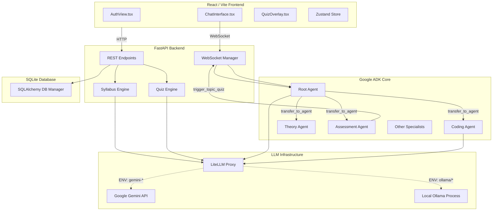
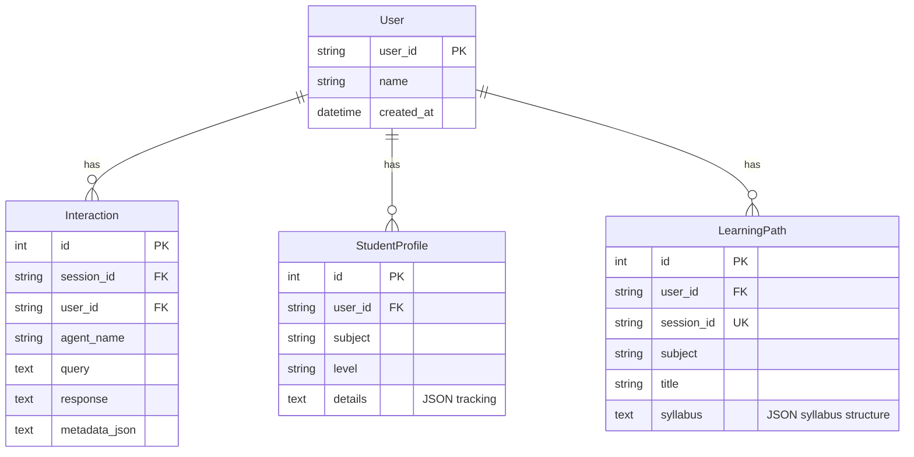
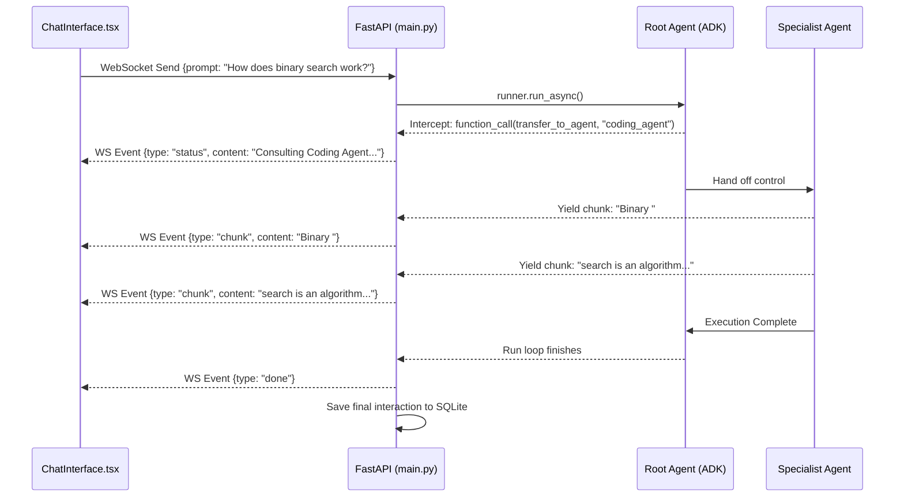
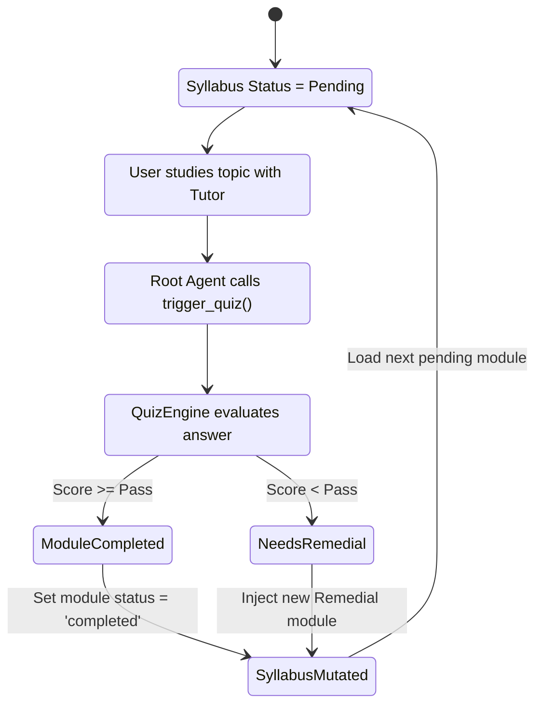

# AI Tutor - Detailed System Architecture

This document provides an exhaustive, deep-dive into the AI Tutor System's architecture, data flows, and code structure. It is designed to be read by any developer looking to understand exactly how the project functions under the hood.

---

## 1. System Overview & Core Loop

The AI Tutor is a sophisticated educational platform that pairs a reactive web interface with a powerful multi-agent intelligence layer. The core loop of the application is:
1. **Onboarding**: Assess the user's skill and dynamically generate a JSON-based syllabus.
2. **Tutoring (Chat)**: User asks questions; a Root Agent analyzes the intent and routes it to a Specialist Agent.
3. **Strict Per-Topic Assessment Checkpoints**: Before moving to any new syllabus topic, the system uses backend metadata enforcement to hard-block progress until a mandatory topic-level quiz is taken via the Assessment Agent.
4. **Syllabus Evolution**: Depending on quiz results, topics are marked in a `completed_topics` array mapping, or the syllabus is dynamically updated with Remedial modules inserted immediately after the current topic.

---

## 2. Component Architecture

### 2.1 The Tech Stack
*   **Frontend**: React, Vite, TailwindCSS, Zustand (State Management), ReactMarkdown (with Mermaid support).
*   **Backend API & WebSockets**: FastAPI, Uvicorn.
*   **Agentic Framework**: Google ADK (Agent Development Kit).
*   **Database**: SQLite via SQLAlchemy (using WAL mode for async concurrency).
*   **LLM Connectivity**: `litellm` used as a universal bridge, allowing the system to hot-swap between Google Gemini API and Local Ollama instances.

### System Topology Diagram

---

## 3. Database Schema & Management

The database is managed entirely within `ai_tutor_agent/utils/db_manager.py`. It uses SQLAlchemy to interface with a local SQLite database (`ai_tutor.db`).

### Schema Features
*   **WAL Mode**: Write-Ahead Logging is explicitly enabled via PRAGMA statements when connecting to SQLite, allowing concurrent reads and writes which is critical for WebSocket chat streaming.
*   **Auto-Migration**: The `DBManager` singleton includes routine checks (like injecting the `metadata_json` column dynamically) to ensure legacy databases don't break the application.

### Entity Relationship Diagram

---

## 4. Agent Orchestration & Logic

The system utilizes a **Hierarchical Orchestrator** pattern built on Google ADK.

### `root_agent` (The Dispatcher)
Located in `ai_tutor_agent/agent.py`, the Root Agent receives every user message. It is strictly instructed *not* to answer complex questions itself. Instead, it evaluates the intent and uses the `transfer_to_agent` tool to route the request.
*   **Rules**: It must perform one action per turn. It cannot loop indefinitely.
*   **Checkpoint Enforcement**: The Root Agent holds the critical instruction to route to the `assessment_agent` whenever a syllabus topic concludes.

### Specialist Agents & Parallel Quiz Execution
Subagents like `coding_agent` (`ai_tutor_agent/subagents/coding_agent/agent.py`) are strictly defined as "terminal agents". They do not have access to routing tools. When invoked, they process the context, generate the specialized response (e.g., writing a Python algorithm), and yield control back to the root level.
*   **Assessment Agent**: Unlike teaching agents, `assessment_agent` exists solely for parallel quiz execution. It receives control when it is time to enforce a quiz checkpoint. Its only tool is `trigger_topic_quiz`, which fires off the UI overlay. It contains a critical hardcoded escape hatch to yield back to the root agent when the quiz finishes to avoid infinite quiz loops on remedial topics.

---

## 5. The Chat Loop & WebSockets

Real-time streaming is achieved via WebSockets, handled in `fastapi_app/main.py`.

### Sequence of Events
1. **Connection**: React opens a connection to `ws://localhost/ws/chat/{session_id}`.
2. **Context Injection**: For the *first* message in a session, FastAPI invisibly injects the user's active syllabus JSON into the LLM prompt. This ensures the Root Agent knows exactly what module the user is currently on.
3. **Execution**: FastAPI invokes the ADK `runner.run_async(prompt)`.
4. **Interception**: As the ADK execution loop runs, FastAPI intercepts Function Calls. 
    *   If `transfer_to_agent` is called, FastAPI sends a `{"type": "status", "content": "Consulting Coding Agent..."}` to the UI.
    *   If `trigger_module_quiz` is called, it sends a `{"type": "trigger_quiz", "module": "..."}` event.
5. **Streaming**: Text chunks generated by the agents are streamed directly to the UI using `{"type": "chunk", "content": "..."}`.

### Chat Stream Sequence Diagram

---

## 6. Dynamic Syllabus & Quizzing System

This is the most complex mechanic in the application. It bypasses the ADK agents to use strict JSON LLM calls via `litellm` directly, ensuring mathematical reliability in state tracking.

### 6.1 Onboarding (`syllabus_engine.py`)
During the onboarding chat, the frontend hits `/api/paths/onboarding/chat`. The syllabus engine prompts the LLM to return `{"status": "ongoing", "question": "..."}` if it needs more information about the user's skill. Once it has enough info, it returns `{"status": "complete", "syllabus": {...}}`.

### 6.2 The Quiz Interruption Loop & Metadata Mapping (`quiz_engine.py`)
1. **Trigger**: Root Agent routes to Assessment Agent, which invokes the `trigger_topic_quiz` tool.
2. **UI Lock**: FastAPI emits the trigger event. The React UI (`ChatInterface.tsx`) creates a mock "system" message with a "Start Quiz" button and disables the chat input box. The DB updates a `quiz_pending_module` flag to block backend routing.
3. **Generation**: The UI calls `/api/quiz/start`. `quiz_engine.py` reads the active syllabus from the DB and generates a JSON question specifically targeting the *current topic*.
4. **Evaluation**: User submits answers to `/api/quiz/answer`. The engine evaluates it. 
5. **Syllabus Mutation & Topic Tracking**:
    *   **Success**: The FastAPI endpoint reads the JSON syllabus, locates the parent module, and injects the topic string into a strict `completed_topics: []` metadata array.
    *   **Remediation**: If the user fails, the LLM generates a granular `wrong_topics` array. The backend dynamically pushes a *new* module object `{"title": "Remedial: [Topic]...", "status": "pending"}` into the user's syllabus list directly after the current parent module.
6. **Backend Hard-Enforcement**: When the AI attempts to update the `current_topic` pointer via the `update_learning_path_details` tool, the backend checks if the *previous* topic exists in the `completed_topics` array. If the AI skipped the quiz, the backend explicitly rejects the DB update and throws an error forcing the AI to trigger the quiz.
7. **Resumption**: The UI unlocks the chat, and sends a hidden `[System Action]` message to confirm completion, guiding the Root Agent to start teaching the next or remedial topic.

### Syllabus Flow Diagram

---

## 7. Frontend State & UI Architecture

Located in `frontend/src/`, the UI uses React and Vite.

*   **`store/store.ts`**: Uses Zustand to manage global state across the app, such as the `activePath` (current session ID), `user` data, and `chatHistory`.
*   **`ChatInterface.tsx`**: 
    *   Listens to the active WebSocket. 
    *   Uses a custom `markdownComponents` object passed to `react-markdown` to intercept `language-mermaid` codeblocks and render them as live, clickable SVG images via the `mermaid.ink` API.
    *   Listens for a global window event (`quiz_completed`) emitted by the QuizOverlay. When received, it silently fires a hidden prompt to the Root Agent: `"[System Action]: The user has successfully passed... proceed to teach the next topic."` to force the agent back into action without user intervention.

---

## 8. LLM Integration & Local Execution (Ollama)

The system is designed to be completely decoupled from any single LLM provider.

*   **File**: `ai_tutor_agent/utils/llm_config.py`
*   **Logic**: The `get_model()` function inspects the `.env` file for the `AGENT_MODEL` variable.
    *   If `AGENT_MODEL=gemini-2.5-flash`, it returns the raw string, and ADK defaults to its native Google GenAI connector.
    *   If `AGENT_MODEL=ollama/llama3.1` (or any string containing a `/`), it wraps the model in ADK's `LiteLlm` compatibility layer.
*   **Quiz/Syllabus Engines**: These use the standard `litellm` library directly. `litellm` acts as a proxy router; passing `model="ollama/llama3.1"` automatically tells it to route the HTTP REST request to `http://localhost:11434/v1/chat/completions` (the default Ollama server) instead of hitting the Google API. This allows developers to run the entire tutor locally for free without changing any application code.
