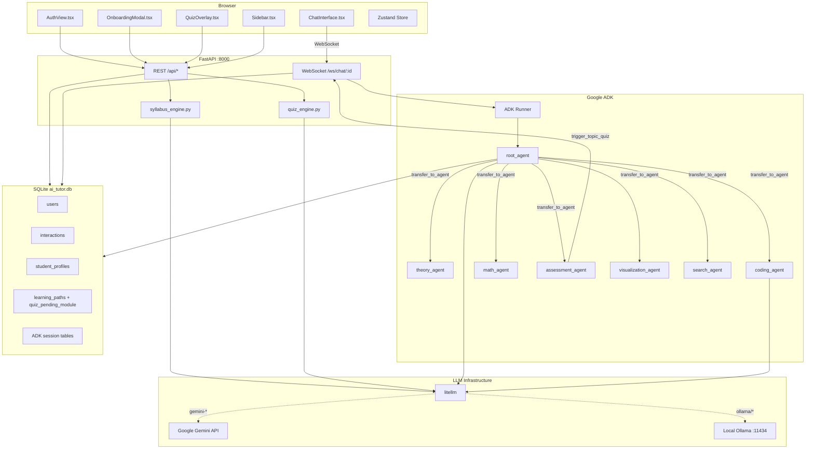
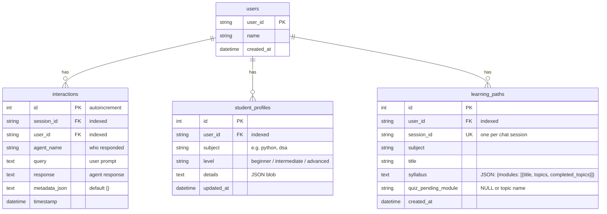
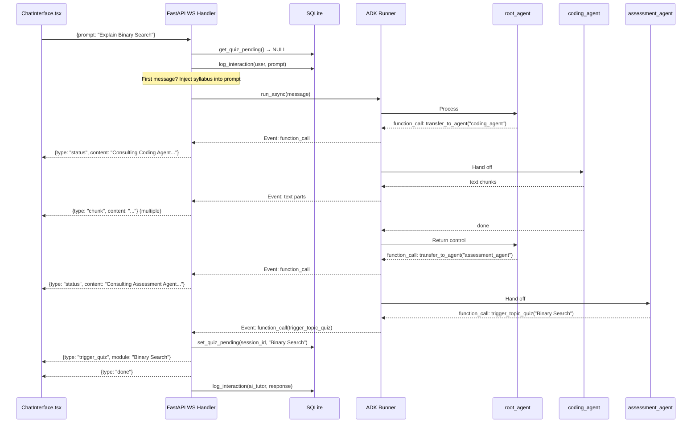
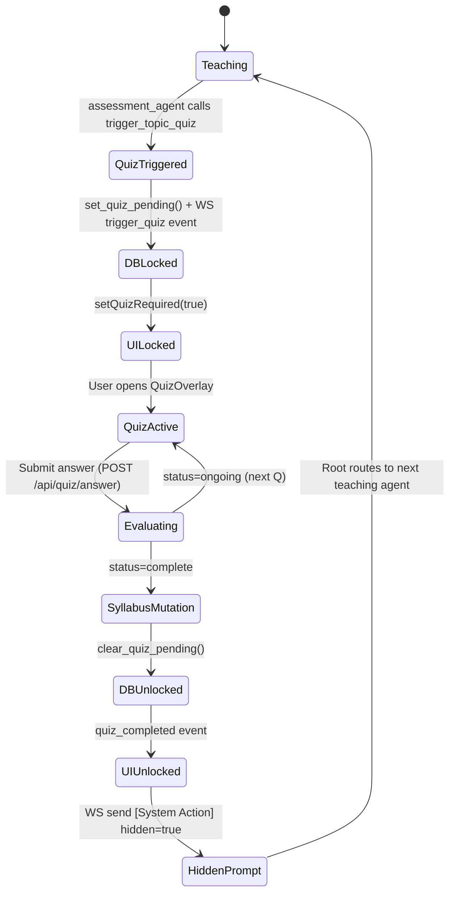

# AI Tutor — Deep-Dive System Architecture

> A complete, file-by-file and function-by-function reference for every significant piece of the AI Tutor codebase.

---

## Table of Contents

1. [System Overview & Core Loop](#1-system-overview--core-loop)
2. [Repository Map](#2-repository-map)
3. [Tech Stack Rationale](#3-tech-stack-rationale)
4. [System Topology Diagram](#4-system-topology-diagram)
5. [Backend — `fastapi_app/`](#5-backend--fastapi_app)
   - [main.py — Endpoints & WebSocket](#51-mainpy--endpoints--websocket)
   - [syllabus_engine.py](#52-syllabus_enginepy)
   - [quiz_engine.py](#53-quiz_enginepy)
6. [Agent Layer — `ai_tutor_agent/`](#6-agent-layer--ai_tutor_agent)
   - [agent.py — Root Agent](#61-agentpy--root-agent)
   - [Subagents](#62-subagents)
   - [shared_tools/db_tools.py](#63-shared_toolsdb_toolspy)
   - [shared_tools/path_tools.py](#64-shared_toolspath_toolspy)
7. [Utils — `ai_tutor_agent/utils/`](#7-utils--ai_tutor_agentutils)
   - [db_manager.py](#71-db_managerpy)
   - [llm_config.py](#72-llm_configpy)
   - [response_parser.py](#73-response_parserpy)
8. [Database Schema & Management](#8-database-schema--management)
9. [Frontend — `frontend/src/`](#9-frontend--frontendsrc)
   - [App.tsx](#91-apptsx)
   - [store/store.ts](#92-storestorety)
   - [components/AuthView.tsx](#93-componentsauthviewtsx)
   - [components/OnboardingModal.tsx](#94-componentsonboardingmodaltsx)
   - [components/Sidebar.tsx](#95-componentssidebartsx)
   - [components/ChatInterface.tsx](#96-componentschatinterfacetsx)
   - [components/QuizOverlay.tsx](#97-componentsquizoverlaytsx)
10. [WebSocket Chat Loop](#10-websocket-chat-loop)
11. [Quiz Gatekeeping System (All 5 Layers)](#11-quiz-gatekeeping-system-all-5-layers)
12. [LLM Provider Switching](#12-llm-provider-switching)
13. [Complete Data Flow Scenarios](#13-complete-data-flow-scenarios)
14. [Design Decisions & Trade-offs](#14-design-decisions--trade-offs)

---

## 1. System Overview & Core Loop

The AI Tutor is a personalized, agentic learning platform. Its core innovation is a **mandatory quiz gatekeeping system** enforced at the database level — the AI cannot skip assessments even if explicitly prompted to.

```
┌────────────────┐    ┌───────────────┐    ┌──────────────────┐    ┌─────────────────┐
│   Onboarding   │ →  │  AI Teaching  │ →  │ Quiz Checkpoint  │ →  │ Syllabus Evolve │
│  (REST / LLM)  │    │  (WebSocket)  │    │  (DB-enforced)   │    │ (Remedial inject)│
└────────────────┘    └───────────────┘    └──────────────────┘    └─────────────────┘
        ↑                                                                    │
        └──────────────────── Loop until course complete ────────────────────┘
```

**Phase 1 – Onboarding**: Multi-turn REST conversation collects subject + skill level. `syllabus_engine.py` calls the LLM and returns a JSON syllabus saved to `learning_paths`.

**Phase 2 – Teaching**: User chats via WebSocket. Root Agent routes every message to a specialist subagent (theory, coding, math, visualization, search). Active syllabus is injected into the first prompt of each session.

**Phase 3 – Quiz Checkpoint**: After teaching, Root Agent transfers to Assessment Agent. Assessment Agent calls `trigger_topic_quiz`, setting a `quiz_pending_module` flag in the DB and firing a `trigger_quiz` WebSocket event. Chat input is hard-locked.

**Phase 4 – Syllabus Evolution**: On quiz answer completion, `/api/quiz/answer` mutates the syllabus JSON — stamping `completed_topics[]` and injecting `Remedial:` module objects for wrong answers.

---

## 2. Repository Map

```
AI-Tutor/
├── ai_tutor_agent/               # Google ADK agent package
│   ├── agent.py                  # Root orchestrator agent
│   ├── adk.yaml                  # ADK app config
│   ├── .env                      # AGENT_MODEL, GOOGLE_API_KEY
│   ├── shared_tools/
│   │   ├── db_tools.py           # FunctionTools: history, update_path, quiz enforcement
│   │   └── path_tools.py         # FunctionTools: create_path, get_context, trigger_quiz
│   ├── subagents/
│   │   ├── assessment_agent/     # 1 tool: trigger_topic_quiz
│   │   ├── coding_agent/         # Terminal — code, DSA, debugging
│   │   ├── math_agent/           # Terminal — math, proofs, equations
│   │   ├── theory_agent/         # Terminal — concepts, explanations
│   │   ├── visualization_agent/  # Terminal — Mermaid.js diagrams
│   │   ├── search_agent/         # google_search or mock fallback
│   │   ├── onboarding_agent/     # Legacy (superseded by syllabus_engine)
│   │   ├── resume_analyzer_agent/# Bonus specialist
│   │   └── account_agent/        # Legacy (superseded by REST auth)
│   └── utils/
│       ├── db_manager.py         # SQLAlchemy singleton, WAL mode, migrations
│       ├── llm_config.py         # Gemini native vs LiteLLM wrapper selector
│       └── response_parser.py    # JSON-unwrapper for structured agent output
│
├── fastapi_app/
│   ├── main.py                   # All REST endpoints + WebSocket handler
│   ├── quiz_engine.py            # Stateless 5-question quiz via litellm (topic-focused)
│   └── syllabus_engine.py        # Stateless onboarding Q&A via litellm
│
├── frontend/src/
│   ├── App.tsx                   # Root: auth guard, layout, onboarding toggle
│   ├── main.tsx                  # ReactDOM entry
│   ├── index.css                 # Global Tailwind + scrollbar styles
│   ├── types.d.ts                # Shared TS types
│   ├── store/store.ts            # Zustand global state (incl. quizRequired)
│   └── components/
│       ├── AuthView.tsx          # Login / Signup / Guest
│       ├── OnboardingModal.tsx   # Path wizard (multi-step Q&A)
│       ├── Sidebar.tsx           # Path list + syllabus + model toggle
│       ├── ChatInterface.tsx     # WebSocket chat, streaming, quiz lock banner
│       ├── QuizOverlay.tsx       # Full-screen quiz modal (wrong_topics list)
│       └── UserProfile.tsx       # Minimal user chip
│
├── ai_tutor.db                   # SQLite (WAL mode, -shm, -wal alongside)
├── requirements.txt
├── requirements-freeze.txt       # Pinned dependency snapshot
├── test_curl.py                  # Dev helper: tests /api/quiz/start via requests
├── test_quiz.py                  # Dev helper: tests generate_first_question directly
└── debug_runner.py               # Standalone ADK CLI runner for dev
```

> **Note**: `streamlit_app.py` has been **removed**. The project now uses the React + FastAPI stack exclusively. All Streamlit-specific code (auth, chat loop, response cleanup, MathJax patching) is no longer part of the codebase.

---

## 3. Tech Stack Rationale

| Layer | Technology | Why |
|---|---|---|
| Frontend Framework | **React + Vite** | Fast HMR, small production bundle |
| Styling | **TailwindCSS** | Utility-first; co-located styles |
| Global State | **Zustand + persist** | Simpler than Redux; localStorage via middleware |
| Markdown | **ReactMarkdown + remark-gfm** | Tables, code, custom component hooks |
| Diagrams | **mermaid.ink API** | Server-side SVG — avoids 2 MB client bundle |
| Backend | **FastAPI + Uvicorn** | Async-first, native WebSocket, auto OpenAPI |
| Agent Framework | **Google ADK** | First-class `transfer_to_agent`, Gemini native |
| Session Storage | **ADK DatabaseSessionService** | Persists conversation state in SQLite |
| Database | **SQLite + SQLAlchemy** | Zero infrastructure; WAL for concurrent WS |
| LLM Bridge | **litellm** | Uniform API for Gemini + Ollama |

---

## 4. System Topology Diagram



---

## 5. Backend — `fastapi_app/`

### 5.1 `main.py` — Endpoints & WebSocket

**File**: `fastapi_app/main.py` (407 lines)

This is the single entry point for all HTTP and WebSocket traffic. It also serves the compiled React frontend as static files.

#### Application Setup

```python
app = FastAPI(title="AI Tutor API", lifespan=lifespan)
app.mount("/app", StaticFiles(directory="frontend/dist", html=True), name="frontend")
```

On startup (`lifespan` async context manager), it calls `await session_service.init_db()` to create ADK's internal session tables in SQLite. The root `/` redirects to `/app/index.html` so one Uvicorn process serves everything.

#### Pydantic Request Models

| Model | Fields | Used By |
|---|---|---|
| `LoginRequest` | `user_id` | `/api/auth/login` |
| `SignupRequest` | `user_id`, `name` | `/api/auth/signup` |
| `OnboardingChatRequest` | `user_id`, `answer`, `history[]` | `/api/paths/onboarding/chat` |
| `CreatePathRequest` | `user_id`, `session_id`, `subject`, `title`, `syllabus` | `/api/paths/create` |
| `QuizStartRequest` | `user_id`, `session_id`, `module_name?` | `/api/quiz/start` |
| `QuizAnswerRequest` | `user_id`, `session_id`, `history[]`, `answer`, `module_name?` | `/api/quiz/answer` |

#### REST Endpoints

| Method | Path | Function | What it does |
|---|---|---|---|
| `POST` | `/api/auth/login` | `login()` | Calls `db_manager.get_user()`. Returns 404 if not found. |
| `POST` | `/api/auth/signup` | `signup()` | Calls `db_manager.create_user()`. Returns 400 on duplicate. |
| `POST` | `/api/auth/guest` | `guest_login()` | Generates `guest_{8 hex chars}` ID, creates user, returns credentials. |
| `GET` | `/api/paths` | `get_paths()` | Returns all `learning_paths` rows for `?user_id`. |
| `GET` | `/api/paths/{session_id}` | `get_path_details()` | Returns path + `student_profile` + parsed `syllabus` JSON. |
| `POST` | `/api/paths/onboarding/start` | `onboarding_start()` | Returns hardcoded first question + subject options array. |
| `POST` | `/api/paths/onboarding/chat` | `onboarding_chat()` | Proxies to `syllabus_engine.handle_onboarding_chat()`. |
| `POST` | `/api/paths/create` | `create_path()` | Creates `learning_paths` row + stores syllabus JSON string. |
| `GET` | `/api/quiz/pending` | `quiz_pending()` | Checks `quiz_pending_module` column. Used on page refresh. |
| `POST` | `/api/quiz/start` | `quiz_start()` | Sets `quiz_pending_module` flag, calls `generate_first_question()`. |
| `POST` | `/api/quiz/answer` | `quiz_answer()` | Calls `evaluate_and_generate_next()`, mutates syllabus, clears flag. |
| `GET` | `/api/chat/history/{session_id}` | `get_chat_history()` | Returns `interactions` table rows for the session. |
| `POST` | `/api/chat/settings/model` | `update_model_settings()` | UI-only toggle; returns status (no actual server-side effect currently). |

#### `quiz_answer()` — Syllabus Mutation Logic

After the quiz finishes (5 questions answered):

1. **Locate parent module** in syllabus list matching `req.module_name` (by title or topic fuzzy match).
2. **Stamp `completed_topics`** — appends `module_name` into `m["completed_topics"]` array.
3. **Inject Remedial modules** — for each topic in `final_review.wrong_topics[]`, inserts a new module object `{"title": "Remedial: {topic}", "subtopics": ["Review: {topic}", "Practice exercises"], "status": "pending"}` at `insert_idx + N` (immediately after the current module). Each wrong answer maps to its own remedial module.
4. **Fallback** — if `needs_remedial` is true but `wrong_topics` is empty, inserts a single generic remedial module using `remedial_topic`.
5. **Persist** — `db_manager.update_learning_path_details(session_id, json.dumps(syllabus_json))`.
6. **Clear lock** — `db_manager.clear_quiz_pending(session_id)` is **always** called at the end (even on error), preventing a permanent chat lock.

#### `websocket_chat()` — WebSocket Handler

```python
@app.websocket("/ws/chat/{session_id}")
async def websocket_chat(websocket: WebSocket, session_id: str, user_id: str):
```

**Full execution flow per message:**

1. `await websocket.accept()` + ADK session upsert.
2. Build `Runner(app_name, agent=root_agent, session_service=...)`.
3. **Loop**: `data = await websocket.receive_text()` → parse JSON (`prompt`, `hidden` fields).
4. **Quiz hard-block** (server-side): If `hidden=False` and `db_manager.get_quiz_pending(session_id)` is non-NULL → send `{type: "quiz_required", module: "..."}` + `{type: "done"}` → `continue` (drops message, never reaches LLM).
5. **Context injection**: First message gets syllabus prepended: `"[System: Active Syllabus context:\n{syllabus}]\n\n{prompt}"`.
6. `runner.run_async(user_id, session_id, message)` → event loop.
7. **Event interception**:
   - `transfer_to_agent` → `{type: "status", content: "Consulting X Agent..."}`
   - `trigger_topic_quiz` → `db_manager.set_quiz_pending(session_id, topic_name)` + `{type: "status", content: "Preparing Mandatory Quiz for {topic_name}..."}` + `{type: "trigger_quiz", module: "..."}` 
   - other tools → `{type: "status", content: "Running {tool_name}..."}`
8. **Chunk streaming**: `event.content.parts[*].text` → `{type: "chunk", content, author}`.
9. `{type: "done"}` + `db_manager.log_interaction(...)` (skipped if `hidden=True`).

---

### 5.2 `syllabus_engine.py`

**File**: `fastapi_app/syllabus_engine.py`

Stateless module. Contains two internal helpers and one public function.

#### `_get_litellm_model() → str`
Reads `AGENT_MODEL` env var. If it's a bare Gemini model name (no `/`), prepends `"gemini/"` because litellm requires a provider prefix. Returns as-is for `ollama/...` models.

#### `_extract_json(text: str) → dict`
Two-pass JSON extractor:
1. Try `json.loads(text.strip())` directly.
2. On failure, use `re.search(r'\{.*\}', text, re.DOTALL)` to strip markdown fences.
3. Return `{}` on total failure.

#### `handle_onboarding_chat(history, user_answer) → dict`

The core onboarding function. Called by `POST /api/paths/onboarding/chat`.

**Input**: `history` (list of prior `{agent, text}` messages from the frontend) + `user_answer` (current user input).

**Process**:
1. Builds a full `messages` list for the LLM, starting with a system prompt that tells the LLM to act as a curriculum designer.
2. Converts frontend message format (`msg["agent"] == "ai_tutor"` → `role: "assistant"`) to OpenAI message format.
3. Appends current `user_answer`.
4. Calls `litellm.completion(model, messages, temperature=0.7)`.
5. Parses response with `_extract_json()`.
6. Returns `{status: "ongoing", question, options}` or `{status: "complete", syllabus, subject, title}`.

**Fallback chains**:
- If LLM forgets `status` but includes `syllabus` key → treat as complete.
- If parsing fails entirely → return `{status: "ongoing", question: "Could you elaborate?"}`.

**Syllabus output format**:
```json
{
  "status": "complete",
  "subject": "python_programming",
  "title": "Python for Beginners",
  "syllabus": {
    "modules": [
      { "title": "Module 1", "topics": ["Topic A", "Topic B"] }
    ]
  }
}
```

---

### 5.3 `quiz_engine.py`

**File**: `fastapi_app/quiz_engine.py`

Stateless module. Shares the same `_get_litellm_model()` and `_extract_json()` helpers as `syllabus_engine.py` (duplicated — not imported from a shared module).

#### `generate_first_question(syllabus, topic_name=None) → dict`

Called by `POST /api/quiz/start`.

**Input**: Raw syllabus JSON string + optional `topic_name` to focus on.

**Process**: Builds a prompt instructing the LLM to generate one question in strict JSON:
```json
{
  "question": "...",
  "type": "mcq",
  "options": ["A", "B", "C", "D"],
  "topic": "specific topic being tested"
}
```
If `topic_name` is provided, the prompt includes: `"Focus ONLY on the topic titled '{topic_name}'. Test knowledge specifically from this topic."` This ensures quiz questions are scoped to the exact topic the user just studied rather than ranging across the whole syllabus.

Calls `litellm.completion()` and returns the parsed dict.

#### `evaluate_and_generate_next(syllabus, history, answer, topic_name=None) → dict`

Called by `POST /api/quiz/answer` on every answer submission.

**Input**: Full syllabus, complete quiz `history` array (prior Q&As), current `answer`, optional `topic_name`.

**Process**: Sends the full history + current answer to the LLM with instructions:
- If fewer than 5 questions asked → evaluate + generate next question (harder if correct, easier if wrong). All follow-up questions stay within the same topic (not the next syllabus topic).
- If 5 or more → generate `final_review` instead of next question.
- If `topic_name` is set, all questions are scoped to that topic via an additional focus instruction.

**Response format (ongoing)**:
```json
{
  "evaluation": "Correct! Because...",
  "is_correct": true,
  "status": "ongoing",
  "next_question": { "question": "...", "type": "mcq", "options": [...], "topic": "..." }
}
```

**Response format (complete, after 5 questions)**:
```json
{
  "evaluation": "...",
  "is_correct": false,
  "status": "complete",
  "final_review": {
    "score": "3/5",
    "feedback": "...",
    "wrong_topics": ["Binary Search edge cases", "Recursion base case"],
    "needs_remedial": true,
    "remedial_topic": "Searching algorithms (main weak area summary)"
  }
}
```

The `wrong_topics` array is **per-question granular** — the LLM now lists every incorrectly-answered question's specific sub-topic (not just one remedial topic). This enables one dedicated remedial module per wrong answer in the syllabus mutation step.

---

## 6. Agent Layer — `ai_tutor_agent/`

### 6.1 `agent.py` — Root Agent

**File**: `ai_tutor_agent/agent.py`

```python
root_agent = Agent(
    name="ai_tutor",
    model=get_model(),
    generate_content_config=get_retry_config(),
    sub_agents=[theory_agent, coding_agent, math_agent, assessment_agent, visualization_agent, search_agent],
    tools=[get_user_history, create_learning_path_tool, get_learning_paths_tool,
           get_current_learning_path_context, update_learning_path_details]
)
```

**Role**: Hierarchical orchestrator. Every user message passes through this agent first. It never answers complex questions itself — it only routes.

**Key instruction rules**:
| Rule | Detail |
|---|---|
| One action per turn | ONE tool call OR ONE `transfer_to_agent` OR text response |
| No chaining after transfer | After specialist returns, output text directly — do NOT call more tools |
| Mandatory quiz | After any teaching agent responds, MUST transfer to `assessment_agent` |
| System Action handling | On `[System Action]` messages (quiz complete), route to next teaching agent — do NOT re-trigger assessment |
| Remedial-first | If remedial topics exist after a quiz, teach them before advancing |

**Routing table**:
| Input type | Destination |
|---|---|
| Theory, history, concepts | `theory_agent` |
| Code, algorithms, DSA, debugging | `coding_agent` |
| Math, proofs, calculations | `math_agent` |
| Quiz needed / checkpoint | `assessment_agent` |
| Diagrams, flowcharts | `visualization_agent` |
| Current events, web info | `search_agent` |
| Simple greetings | Text response (no transfer) |

---

### 6.2 Subagents

All subagents are defined in `ai_tutor_agent/subagents/{name}/agent.py`.

#### `theory_agent`
**Type**: Terminal (no tools, no sub_agents)
**Role**: Explains concepts across all subjects — CS theory, history, biology, system design.
**Workflow**: Break down topic → use analogies → structured explanation → note if code/math is better handled elsewhere.
**Key instruction**: `"NEVER ask if the user is ready for a quiz. The system handles it automatically."`

#### `coding_agent`
**Type**: Terminal (no tools, no sub_agents)
**Role**: Write, debug, and explain code; algorithms (DSA); web/mobile dev.
**Workflow**: Provide documented code → explain Time/Space complexity → suggest best practices and edge cases.
**Key instruction**: `"NEVER ask if the user is ready for a quiz."` + `"You are a terminal agent. TEXT ONLY."`

#### `math_agent`
**Type**: Terminal (no tools, no sub_agents)
**Role**: Numerical problem solving, proofs, formulas.
**Workflow**: State the theorem/formula → show step-by-step derivation → clear final answer. Uses LaTeX math blocks.
**Key instruction**: Same terminal + no-quiz-prompt rules.

#### `visualization_agent`
**Type**: Terminal (no tools, no sub_agents)
**Role**: Generates Mermaid.js diagram code for visual learning.
**Workflow**: Choose best chart type → generate valid Mermaid code block.
**Critical syntax rules in prompt** (to prevent LLM errors):
- Node IDs must use underscores, not spaces: `Module_1` not `Module 1`
- Subgraph syntax: `subgraph ID [Label with Spaces]`
- Styles reference the ID: `style Module_1 fill:#fff`

#### `search_agent`
**Type**: Non-terminal (has 1 tool: `google_search` or mock fallback)
**Role**: Web searches for current events and real-time information.
**Model-dependent tool**: On startup it checks if the model is Gemini:
```python
if "gemini" in str(model_val).lower():
    from google.adk.tools import google_search
    tools_list.append(google_search)
else:
    # Ollama mode: mock search to avoid API errors
    def web_search(query: str) -> str:
        return f"Mock search result for '{query}'. Web search disabled for local models."
```

#### `assessment_agent`
**Type**: Non-terminal (has 1 tool: `trigger_topic_quiz`)
**Role**: The quiz checkpoint enforcer. Sole purpose is to call `trigger_topic_quiz`.
**Escape hatch**: If the incoming message starts with `[System Action]` (quiz completion confirmation), it must NOT trigger a quiz. It responds: `"Quiz sequence finished. Returning to tutor."` This prevents an infinite quiz loop.

---

### 6.3 `shared_tools/db_tools.py`

ADK `FunctionTool`-wrapped Python functions available to the root agent. ADK auto-generates JSON schemas from signatures + docstrings.

#### `check_user(user_id, tool_context) → dict`
Looks up user by `user_id`. On success, stamps `tool_context.state["current_user_id"]` and `authenticated = True`. Used by legacy auth flow.

#### `create_user(user_id, name, tool_context) → dict`
Creates a new user in the DB. Auto-generates a UUID suffix for `guest_*` IDs. Sets ADK session state for identity.

#### `log_conversation(agent_name, query, response, tool_context, metadata_json) → dict`
Logs a conversation turn to the `interactions` table. Used by legacy flows (the WebSocket handler now logs directly).

#### `get_user_history(tool_context) → dict`
Returns up to 50 recent `interactions` rows for the current `user_id + session_id`. The root agent calls this when it needs to recall what the user was studying.

#### `get_student_profile(subject, tool_context) → dict`
Fetches the `student_profiles` row for a given `subject`. Used to get current level and learning details.

#### `update_student_profile(subject, level, details, tool_context) → dict`
Upserts the `student_profiles` row. Used to track skill level changes.

#### `update_learning_path_details(syllabus, level, tool_context) → dict` ⚠️ Quiz Enforcement Gateway

This is the **critical quiz enforcement tool**. When the root agent calls this to update `current_topic` in the syllabus, the function:

1. Parses the `syllabus` JSON string to extract the new `current_topic`.
2. Fetches the old syllabus from the DB and extracts the old `current_topic`.
3. If `old_topic != new_topic` (i.e., AI is trying to advance), it scans all modules' `completed_topics[]` arrays.
4. If `old_topic` is **not** found in any module's `completed_topics`, it **rejects the update**:
   ```
   ERROR: Mandatory Quiz Checkpoint! You MUST trigger the quiz for '{old_topic}'
   using trigger_topic_quiz before moving to '{new_topic}'. Update rejected.
   ```
5. On success, calls `db_manager.update_learning_path_details(session_id, syllabus)`.
6. If `level` is also provided, updates the `student_profiles` row.

---

### 6.4 `shared_tools/path_tools.py`

#### `create_learning_path_tool(subject, title, tool_context) → dict`
Creates a `learning_paths` DB row for the current session. If no `student_profile` exists for the subject, bootstraps one with `level = "Unknown"` and an empty syllabus. Used by the root agent to create new paths (legacy; now done via REST).

#### `get_learning_paths_tool(tool_context) → dict`
Returns all learning paths for the user. **Redacts** the `syllabus` field for every non-current session to prevent the LLM from confusing syllabuses across sessions. Only the current session's syllabus is visible.

#### `get_current_learning_path_context(tool_context) → dict`
Returns `{title, subject, syllabus_json}` for the active `session_id`. The root agent calls this when it needs to know the current state of the course without the full history being available.

#### `trigger_topic_quiz(topic_name, tool_context) → dict`
The quiz trigger signal function. Returns a structured response:
```python
{
    "status": "quiz_triggered",
    "message": "A mandatory quiz for '{topic_name}' has been activated...",
    "_internal_action": "open_quiz"
}
```
FastAPI's WebSocket handler intercepts the **function call event** (not the return value) in the `run_async` loop and fires the `trigger_quiz` WebSocket event. The return value is just informational for the ADK event log.

---

## 7. Utils — `ai_tutor_agent/utils/`

### 7.1 `db_manager.py`

**File**: `ai_tutor_agent/utils/db_manager.py` (386 lines)

The central data access layer for all application tables.

#### Class: `DBManager` (Singleton)

Uses Python's `__new__` to enforce exactly one instance per process. Instantiated at module-import time as `db_manager = DBManager()`.

**`__new__` init sequence**:
1. Create SQLAlchemy `engine` from `DATABASE_URI` env var (defaults to `sqlite:///ai_tutor.db`).
2. For SQLite, register a `connect` event listener to apply four PRAGMAs on every new connection:
   - `PRAGMA journal_mode=WAL` — Write-Ahead Logging (concurrent reads during writes)
   - `PRAGMA synchronous=NORMAL` — Reduce fsync overhead (safe with WAL)
   - `PRAGMA cache_size=-64000` — 64 MB page cache in RAM
   - `PRAGMA temp_store=MEMORY` — Temp tables in RAM
3. `Base.metadata.create_all(engine)` — creates all tables.
4. `ALTER TABLE learning_paths ADD COLUMN syllabus` (try/except — idempotent).
5. `ALTER TABLE learning_paths ADD COLUMN quiz_pending_module` (try/except).
6. `_check_and_migrate()` for legacy column additions.

#### `_check_and_migrate(db_uri)`
Directly uses `sqlite3` (not SQLAlchemy) to inspect schema and add missing columns. Handles:
- ADK's legacy `events` table: adds `input_transcription`, `output_transcription` columns if missing.
- `interactions` table: adds `metadata_json` column if missing.

This ensures old databases work without manual migration.

#### Key Methods

| Method | Signature | What it does |
|---|---|---|
| `create_user` | `(user_id, name) → dict` | Inserts `users` row. Returns `{success, user_id, name}`. |
| `get_user` | `(user_id) → dict\|None` | Queries `users` by PK. Returns `{user_id, name}` or `None`. |
| `log_interaction` | `(session_id, user_id, agent_name, query, response, metadata_json) → bool` | Inserts `interactions` row. |
| `get_chat_history` | `(user_id, session_id, limit=50) → list` | Returns last N interactions in chronological order (reversed from DESC query). |
| `update_student_profile` | `(user_id, subject, level, details) → bool` | Upserts `student_profiles`. |
| `get_student_profile` | `(user_id, subject=None) → list\|dict` | Returns single profile or all profiles if subject is None. |
| `create_learning_path` | `(user_id, session_id, subject, title) → bool` | Inserts `learning_paths` row. No-op if session already exists. |
| `update_learning_path_details` | `(session_id, syllabus) → bool` | Updates `syllabus` TEXT column for session. |
| `get_learning_paths` | `(user_id) → list` | Returns all paths ordered by `created_at DESC`. |
| `set_quiz_pending` | `(session_id, module_name) → bool` | Sets `quiz_pending_module = module_name`. Locks the chat. |
| `clear_quiz_pending` | `(session_id) → bool` | Sets `quiz_pending_module = NULL`. Unlocks the chat. |
| `get_quiz_pending` | `(session_id) → str\|None` | Returns `quiz_pending_module` value or `None`. |

**Two DB consumers in one file**: The same `ai_tutor.db` file is used by both `DBManager` (sync SQLAlchemy) and ADK's `DatabaseSessionService` (async aiosqlite). They use separate table namespaces and WAL mode prevents conflicts.

---

### 7.2 `llm_config.py`

**File**: `ai_tutor_agent/utils/llm_config.py`

#### `get_model() → str | LiteLlm`

Reads `AGENT_MODEL` env var (default: `"gemini-2.5-flash"`).

| `AGENT_MODEL` value | Returns | ADK behavior |
|---|---|---|
| `"gemini-2.5-flash"` (no `/`) | Raw string `"gemini-2.5-flash"` | ADK uses native Google GenAI connector |
| `"ollama/llama3.1"` | `LiteLlm(model="ollama/llama3.1")` | ADK routes via litellm → localhost:11434 |
| `"openai/gpt-4o"` (any `/`) | `LiteLlm(model="openai/gpt-4o")` | ADK routes via litellm → OpenAI API |

#### `get_retry_config() → GenerateContentConfig | None`

For Gemini-only: wraps up to 15 retry attempts with 2-second initial delay into a `types.GenerateContentConfig`. This handles Gemini rate-limiting transparently without crashing the agent.

For `LiteLlm` models: returns `None` (litellm manages its own retries).

---

### 7.3 `response_parser.py`

**File**: `ai_tutor_agent/utils/response_parser.py`

A utility module for cleaning structured JSON responses from older agent versions that used to return JSON objects instead of plain text.

#### `parse_agent_response(response_content, tool_context) → any`
Top-level after-agent callback. If the content is a string, tries `try_parse_json_wrapper()`. Returns as-is if not parseable or not a string.

#### `try_parse_json_wrapper(text) → str | None`
Checks if the text looks like a JSON object (`{...}`). If so, tries to extract readable content from known patterns:
- `dsa_agent_response.explanation` → returns explanation text
- `developer_agent_response` → returns string value
- `system_design_agent_response` → returns string value
- Generic `{"response": "..."}` → returns value
- Any `_response`-suffixed key → returns value
- Fallback: pretty-prints the whole JSON

#### `format_code_response(data) → str`
Formats dicts containing `explanation` + `code` + optional `complexity` into a readable markdown string with code fences.

> **Note**: This module is largely a legacy artifact. Current agents are instructed to return plain text (no JSON wrapping), so this parser is rarely triggered.

---

## 8. Database Schema & Management



**`learning_paths.syllabus` evolution across a session**:

```json
// Initial (from onboarding)
{ "modules": [{ "title": "Module 1", "topics": ["Topic A", "Topic B"] }] }

// After quiz (topic stamped + remedial injected)
{
  "modules": [
    {
      "title": "Module 1",
      "topics": ["Topic A", "Topic B"],
      "completed_topics": ["Topic A"]
    },
    {
      "title": "Remedial: Binary Search edge cases",
      "topics": ["Review: Binary Search edge cases", "Practice exercises"],
      "status": "pending"
    }
  ]
}
```

---

## 9. Frontend — `frontend/src/`

### 9.1 `App.tsx`

**File**: `frontend/src/App.tsx` (38 lines)

The root component. Acts as an auth guard and layout shell.

```
if (!user) → render <AuthView />
else → render full layout:
  <Sidebar onNewChat={setShowOnboarding(true)} />
  <main>
    <header><UserProfile /></header>
    <ChatInterface />
    <QuizOverlay />   ← always mounted, renders null when quizActive=false
  </main>
  {showOnboarding && <OnboardingModal />}
```

`showOnboarding` is local React state (not Zustand) because it's a transient UI toggle.

---

### 9.2 `store/store.ts`

**File**: `frontend/src/store/store.ts`

Zustand store with `persist` middleware. Only `{user, activePath, modelMode}` survive page refresh (localStorage). All quiz and chat state is in-memory only.

#### State Shape

| Key | Type | Persisted | Purpose |
|---|---|---|---|
| `user` | `User \| null` | ✅ | Logged-in user credentials |
| `activePath` | `string \| null` | ✅ | Active `session_id` |
| `modelMode` | `'local' \| 'online'` | ✅ | UI toggle (visual only) |
| `chatHistory` | `ChatMessage[]` | ❌ | All messages in current session |
| `quizActive` | `boolean` | ❌ | QuizOverlay mounted? |
| `quizModule` | `string \| null` | ❌ | Topic being quizzed |
| `quizPreloadedData` | `any` | ❌ | First Q from `/api/quiz/start` (cached) |
| `activeQuizMsgId` | `string \| null` | ❌ | Chat card ID linked to active quiz |
| `quizRequired` | `boolean` | ❌ | Chat input hard-locked (amber banner shown) |

> `quizRequired` is now a **first-class Zustand field** (previously ad-hoc). It is set to `true` on `quiz_required` WS events and `trigger_quiz` events, and explicitly cleared to `false` by `QuizOverlay.handleClose()` and the `quiz_completed` event handler in `ChatInterface`.

#### Key Actions

| Action | What it does |
|---|---|
| `setUser(user)` | Set auth state. `null` = logged out → App renders `AuthView`. |
| `setActivePath(id)` | Change active session. Triggers ChatInterface to reconnect WebSocket. |
| `addChatMessage(msg)` | Append message to `chatHistory`. |
| `updateLastMessage(content)` | Append text chunk to the last message (streaming). |
| `updateQuizTriggerMessage(msgId, status, data, score, feedback)` | Update quiz card status in chat history. |
| `setQuizState(active, module, msgId)` | Mount/unmount QuizOverlay. |
| `setQuizRequired(bool)` | Lock/unlock chat input + show/hide amber lock banner. |

#### `ChatMessage` Interface

```typescript
interface ChatMessage {
  id: number | string;
  agent: string;           // "user" | "ai_tutor" | "coding_agent" | "system" | ...
  query?: string;
  response: string;        // Accumulated text (streamed via updateLastMessage)
  timestamp: string;
  author?: string;
  isQuizTrigger?: boolean; // Render quiz card instead of markdown
  quizModule?: string;
  quizStatus?: 'loading' | 'ready' | 'completed' | 'abandoned';
  quizScore?: string;
  quizFeedback?: string;
}
```

---

### 9.3 `components/AuthView.tsx`

**File**: `frontend/src/components/AuthView.tsx`

Handles three auth paths:
- **Login**: `POST /api/auth/login` → on success, `setUser({user_id, name})`.
- **Signup**: `POST /api/auth/signup` → on success, `setUser(...)`.
- **Guest**: `POST /api/auth/guest` → receives auto-generated `guest_{id}`, `setUser(...)`.

No JWT or session tokens — the `user_id` string is the identity. Persisted in Zustand localStorage.

---

### 9.4 `components/OnboardingModal.tsx`

**File**: `frontend/src/components/OnboardingModal.tsx`

A full-screen modal wizard. Shows after auth when the user clicks "New Learning Path".

#### Key functions

| Function | What it does |
|---|---|
| `startOnboarding()` | `POST /api/paths/onboarding/start` → gets first question + options. Runs on mount. |
| `handleSend(e?, overrideText?)` | Sends current input (or clicked option) to `POST /api/paths/onboarding/chat`. Appends messages to local state. On `status: "complete"`, sets `finalSyllabus`. |
| `handleCreatePath()` | Generates `sessionId = path_${Date.now()}`. `POST /api/paths/create` with syllabus JSON. On success, `setActivePath(sessionId)` → closes modal → chat opens. |

**Option chips**: When the last AI message includes `options[]`, they are rendered as clickable buttons that call `handleSend(undefined, optionText)` — skipping the text input.

**Syllabus preview**: When `finalSyllabus` is set, a scrollable module list is shown with module number badges (`M1`, `M2`...) and topic lists before the "Create Path" button appears.

---

### 9.5 `components/Sidebar.tsx`

**File**: `frontend/src/components/Sidebar.tsx`

Left panel. Switches between two views based on whether `activePath` is set.

#### No active path (path list view)
- "New Learning Path" button → `props.onNewChat()` → opens `OnboardingModal`.
- Lists all paths from `GET /api/paths` with subject label.
- Clicking a path → `setActivePath(session_id)` → chat opens.

#### Active path (syllabus view)
- Fetches `GET /api/paths/{session_id}` for detailed view.
- Listens to `window.addEventListener('path_updated')` — re-fetches when QuizOverlay fires this event after quiz completion.
- Shows progress bar: `completedModules / totalModules * 100%`.
- Renders module list as a vertical timeline with dot indicators:
  - Completed → white dot, white line
  - In-progress → bright dot with glow
  - Pending → dark dot

#### Key functions

| Function | What it does |
|---|---|
| `fetchPaths()` | `GET /api/paths?user_id=...` → updates local `paths` state. |
| `fetchPathDetails(sessionId)` | `GET /api/paths/{sessionId}?user_id=...` → updates `activePathDetails`. |
| `toggleModel(newMode)` | `POST /api/chat/settings/model` → updates `modelMode` in Zustand (UI toggle only). |

**Syllabus normalization**: Handles three different syllabus formats that may exist in the DB:
```typescript
if (Array.isArray(syllabus)) → use directly
else if (syllabus.syllabus) → use syllabus.syllabus array
else if (syllabus.modules) → map modules to {module, subtopics, status} format
```

---

### 9.6 `components/ChatInterface.tsx`

**File**: `frontend/src/components/ChatInterface.tsx`

The main chat view. Manages the WebSocket connection, message streaming, quiz event handling, Mermaid diagram rendering, and the quiz lock banner UI.

#### `MermaidRenderer` component
Converts a Mermaid code string to a rendered image via `mermaid.ink`:
```typescript
const state = { code: chartStr, mermaid: { theme: 'dark' } };
const b64 = btoa(unescape(encodeURIComponent(JSON.stringify(state))));
const src = `https://mermaid.ink/img/${b64}`;
```
- Renders as `` (clickable → opens lightbox)
- On `onError` → sets `hasError = true` → shows raw code block instead

#### `markdownComponents`
Custom renderer passed to `ReactMarkdown`. Key override:
- **`code` component**: If `className` contains `language-mermaid` and block is non-inline → renders `<MermaidRenderer>` instead of a `<pre>` block.
- **`img` component**: Wrapped in `ErrorBoundary` + click-to-lightbox behavior.

#### WebSocket Effects (`useEffect` on `[activePath, user]`)

1. Fetches chat history: `GET /api/chat/history/{activePath}`.
2. Opens WebSocket: `ws(s)://host/ws/chat/{activePath}?user_id=...`.
3. **`onmessage` handler** processes all server events:
   | Event type | Action |
   |---|---|
   | `status` | `setStreamingStatus(content)` → shows routing pill |
   | `chunk` | `updateLastMessage(content)` + clear status |
   | `done` | `setIsStreaming(false)` |
   | `trigger_quiz` | `setQuizRequired(true)`, create quiz trigger message, `POST /api/quiz/start`, auto-open overlay |
   | `quiz_required` | `setQuizRequired(true)` — server-enforced re-lock (e.g., on page refresh message attempt) |
4. Checks pending quiz: `GET /api/quiz/pending` → if pending, auto-restores quiz overlay (handles page refresh).

#### Quiz Completion Event Handler (`useEffect` on `[]`)

```typescript
window.addEventListener('quiz_completed', (e) => {
  const { module, wrongTopics, score } = e.detail;
  useAppStore.getState().setQuizRequired(false);  // Unlock chat
  wsRef.current.send(JSON.stringify({
    prompt: `[System Action]: The user has completed the mandatory quiz for '${module}' with score ${score}. Wrong topics: ${wrongTopics.join(', ')}...`,
    hidden: true  // Don't log, don't block quiz check
  }));
});
```
The event now carries `wrongTopics[]` and `score` from `QuizOverlay`, passing them into the hidden system message so the root agent is aware of remedial topics that were injected. The hidden message resumes the tutor without user intervention.

#### `handleSubmit(e)`

On form submit:
1. Validates: input must be non-empty, `activePath` set, WebSocket open, not currently streaming.
2. Adds user message to `chatHistory`.
3. Adds empty AI placeholder message (will be filled via `updateLastMessage`).
4. `setIsStreaming(true)` + `setStreamingStatus('Analyzing...')`.
5. `wsRef.current.send({prompt: input})`.

#### Quiz Lock Banner

When `quizRequired === true`, an amber animated banner is displayed above the chat input:
```tsx
<div className="flex items-center gap-3 px-4 py-3 bg-amber-500/10 border border-amber-500/30 rounded-xl text-amber-400 text-sm font-medium animate-pulse">
  <span>🔒</span>
  <span>Complete the mandatory quiz to unlock the chat and continue learning.</span>
</div>
```
The input field also switches to amber border styling and its `placeholder` changes to `"🔒 Complete the quiz to continue..."`. Both the input and submit button have `disabled={isStreaming || quizRequired}`.

#### Quiz Card Rendering

When `msg.isQuizTrigger === true`, the message renders a quiz card instead of markdown:
- `quizStatus = 'loading'` → spinner button (disabled)
- `quizStatus = 'ready'` → glowing indigo button "Start Quiz →" → opens QuizOverlay
- `quizStatus = 'completed'` → green success card with score
- `quizStatus = 'abandoned'` → red error card

---

### 9.7 `components/QuizOverlay.tsx`

**File**: `frontend/src/components/QuizOverlay.tsx`

Full-screen blocking modal. Renders `null` when `quizActive === false`. The close (✕) button is **hidden until `status === 'complete'`** — users cannot dismiss the quiz mid-way.

#### State Shape (`QuizState`)

```typescript
interface QuizState {
  status: 'loading' | 'active' | 'evaluating' | 'complete';
  currentQuestion?: Question;
  history: { question: string; user_answer: string }[];
  finalReview?: {
    score: string;
    feedback: string;
    needs_remedial: boolean;
    wrong_topics?: string[];       // Per-question granular wrong topics list
    remedial_topic?: string;       // Fallback: main weak area summary
    syllabus_updated?: boolean;
  };
  evaluationFeedback?: string;   // Shown for 3s after each answer
  evaluationIsCorrect?: boolean;
}
```

#### On Mount Effect

If `quizActive && status === 'loading'`:
1. If `quizPreloadedData` exists → use it immediately (no fetch needed — pre-fetched by ChatInterface).
2. Else → fallback `POST /api/quiz/start` (handles rare case where preload failed).

#### `handleSubmit(e?)`

Called on "Submit Answer" button:
1. Sets `status = 'evaluating'` (disables button, shows spinner).
2. Appends `{question, user_answer}` to local `history`.
3. `POST /api/quiz/answer` with full `{user_id, session_id, history, answer, module_name}`.
4. On `status: "ongoing"` → updates `currentQuestion`, shows `evaluationFeedback` for 3 seconds.
5. On `status: "complete"`:
   - Updates quiz card in chatHistory: `updateQuizTriggerMessage(activeQuizMsgId, 'completed', null, score, feedback)`.
   - Fires `window.dispatchEvent(new CustomEvent('quiz_completed', {detail: {module, wrongTopics: final_review.wrong_topics, score}}))`.
   - Fires `window.dispatchEvent(new CustomEvent('path_updated'))` — triggers Sidebar to re-fetch syllabus.

#### `handleClose()`

Called only after quiz is `complete` (close button rendered only in `complete` state). Sets `quizActive = false` + `quizRequired = false` via `useAppStore.getState().setQuizRequired(false)`. Also always dispatches `path_updated` event to refresh the sidebar.

#### UI States

| State | What renders |
|---|---|
| `loading` | Full-screen spinner |
| `active` (MCQ) | Option buttons + selection highlight |
| `active` (short_answer) | `<textarea>` |
| `evaluating` | Feedback banner (green/red) + spinner on submit button |
| `complete` | Score circle + feedback text + **amber `wrong_topics[]` list** (one item per wrong answer, with bullet dots) OR generic remedial notice if `needs_remedial=true` but `wrong_topics` is empty |

> **Button label changed**: The completion CTA is now **"Done & Continue Learning"** (was "Done & Return to Chat").

---

## 10. WebSocket Chat Loop



---

## 11. Quiz Gatekeeping System (All 5 Layers)

The quiz cannot be skipped. Five independent layers enforce this:

### Layer 1 — Root Agent Prompt (Soft)
`"MANDATORY QUIZ CHECKPOINT: After teaching any topic, MUST transfer to assessment_agent."`

### Layer 2 — WebSocket Server-Side DB Check (Hard Block)
```python
# Runs BEFORE every non-hidden message reaches the LLM
if not hidden:
    pending_module = db_manager.get_quiz_pending(session_id)
    if pending_module:
        await websocket.send_json({
            "type": "quiz_required",
            "module": pending_module,
            "content": f"You must complete the quiz for '{pending_module}' before continuing."
        })
        await websocket.send_json({"type": "done"})
        continue  # Message never reaches LLM
```
The `db_manager.set_quiz_pending()` is now called directly inside the WS handler when a `trigger_topic_quiz` function call is intercepted (previously this was done inside the tool itself).

### Layer 3 — `update_learning_path_details` Tool (API-level Rejection)
If AI calls this tool to move to a new `current_topic` without that old topic in `completed_topics[]` → returns error string forcing quiz trigger.

### Layer 4 — UI Input Lock (Client-side)
`disabled={isStreaming || quizRequired}` on `<input>` + amber animated lock banner above the input with pulsing animation. Input border turns amber and placeholder text changes to `"🔒 Complete the quiz to continue..."`.

### Layer 5 — Page Refresh Recovery
On WebSocket reconnect: `GET /api/quiz/pending` → if non-null, auto-restores quiz overlay and re-locks input.

### Quiz Completion State Machine



---

## 12. LLM Provider Switching

Change only `AGENT_MODEL` in `ai_tutor_agent/.env`:

| Value | Provider | Notes |
|---|---|---|
| `gemini-2.5-flash` | Google Gemini | Default. ADK native connector. Retries enabled. |
| `gemini-2.0-flash-lite` | Google Gemini | Faster/cheaper alternative. |
| `ollama/llama3.1` | Local Ollama | Routes to `http://localhost:11434`. Fully offline. |
| `ollama/mistral` | Local Ollama | Any model loaded in Ollama. |
| `openai/gpt-4o` | OpenAI | Requires `OPENAI_API_KEY`. |

**Two LLM client paths**:
- **ADK agents** → `llm_config.get_model()` → native or `LiteLlm` wrapper
- **Syllabus/Quiz engines** → `litellm.completion()` directly → same env var, different prefix logic

**Search agent degrades gracefully**: When `AGENT_MODEL` is not Gemini, `google_search` is replaced with a `web_search` mock function that returns a disabled message, so the agent doesn't crash.

---

## 13. Complete Data Flow Scenarios

### Scenario A: New User Signs Up and Starts Learning

```
1. User opens app → App.tsx: user=null → renders AuthView
2. User enters ID + name → POST /api/auth/signup
   → db_manager.create_user() → {success: true}
3. setUser({user_id, name}) → Zustand persists to localStorage
4. App re-renders → shows main layout + sidebar
5. User clicks "New Learning Path" → setShowOnboarding(true)
6. OnboardingModal mounts → startOnboarding()
   → POST /api/paths/onboarding/start
   → returns {question: "What subject?", options: ["Python", "DSA", ...]}
7. User clicks "Python" → handleSend(undefined, "Python")
   → POST /api/paths/onboarding/chat {answer: "Python", history: [...]}
   → syllabus_engine → litellm → Gemini
   → returns {status: "ongoing", question: "What's your level?", options: [...]}
8. User clicks "Beginner" → handleSend(undefined, "Beginner")
   → POST /api/paths/onboarding/chat {answer: "Beginner", history: [...]}
   → syllabus_engine → litellm → Gemini
   → returns {status: "complete", subject: "python_programming",
              title: "Python for Beginners", syllabus: {modules: [...]}}
9. finalSyllabus set → syllabus preview renders
10. User clicks "Create Path & Start Learning"
    → handleCreatePath(): sessionId = "path_1718349600000"
    → POST /api/paths/create {user_id, session_id, subject, title, syllabus: JSON.stringify(...)}
    → db_manager.create_learning_path() + update_learning_path_details()
11. setActivePath("path_1718349600000") → modal closes → ChatInterface mounts
12. ChatInterface effect: GET /api/chat/history/{sessionId} → []
13. WebSocket: ws://host/ws/chat/path_...?user_id=...
    → FastAPI creates ADK session {current_user_id, authenticated}
14. GET /api/quiz/pending → {pending: false}
```

### Scenario B: User Messages → Teaching → Quiz → Remedial

```
1. User types "Explain Python lists" → handleSubmit()
   → addChatMessage(user_msg) + addChatMessage(empty AI placeholder)
   → wsRef.send({prompt: "Explain Python lists"})

2. FastAPI WS handler:
   → get_quiz_pending() → NULL → proceed
   → log_interaction(user, "Explain Python lists")
   → First message → prepend "[System: Active Syllabus:\n{...}]\n\nExplain Python lists"
   → runner.run_async()

3. ADK: root_agent processes
   → decides: theory question → transfer_to_agent("theory_agent")
   → FastAPI intercepts event → WS: {type: "status", content: "Consulting Theory Agent..."}
   → theory_agent generates explanation in chunks
   → FastAPI streams: {type: "chunk", content: "..."} (many)
   → updateLastMessage() appends each chunk → React re-renders last message only

4. theory_agent done → control returns to root_agent
   → root_agent: quiz checkpoint time → transfer_to_agent("assessment_agent")
   → FastAPI: {type: "status", content: "Consulting Assessment Agent..."}
   → assessment_agent: calls trigger_topic_quiz("Python Lists")
   → FastAPI intercepts trigger_topic_quiz function_call:
     → db_manager.set_quiz_pending(session_id, "Python Lists")
     → WS: {type: "trigger_quiz", module: "Python Lists"}

5. ChatInterface onmessage (trigger_quiz):
   → setQuizRequired(true) — lock input
   → addChatMessage({isQuizTrigger: true, quizStatus: "loading", ...})
   → POST /api/quiz/start {module_name: "Python Lists"}
   → generate_first_question(syllabus, "Python Lists") via litellm
   → updateQuizTriggerMessage(msgId, "ready", firstQuestion)
   → setQuizState(true, "Python Lists", msgId) → QuizOverlay opens

6. WS: {type: "done"}
   → log_interaction(ai_tutor, full_response)

7. User answers 5 quiz questions:
   Each: POST /api/quiz/answer → evaluate_and_generate_next()
   After Q5: status = "complete"
   → QuizOverlay: score = "3/5", wrong_topics = ["List slicing", "List comprehension"]
   → updateQuizTriggerMessage(msgId, "completed", null, "3/5", feedback)
   → dispatchEvent('quiz_completed', {module, wrongTopics, score})
   → dispatchEvent('path_updated') → Sidebar re-fetches syllabus

8. FastAPI /api/quiz/answer (on status=complete):
   → Find "Python Lists" module in syllabus
   → Stamp m["completed_topics"] = ["Python Lists"]
   → Insert Remedial: List slicing at insert_idx+0
   → Insert Remedial: List comprehension at insert_idx+1
   → update_learning_path_details(session_id, new JSON)
   → clear_quiz_pending(session_id) → chat unlocked

9. ChatInterface 'quiz_completed' listener:
   → setQuizRequired(false)
   → wsRef.send({prompt: "[System Action]: Quiz completed... Remedial topics added...", hidden: true})

10. FastAPI WS: hidden=true → skip quiz pending check, skip logging
    → runner.run_async("[System Action]...")
    → root_agent: sees [System Action] → does NOT re-trigger assessment
    → routes to theory_agent for "Remedial: List slicing"
    → streams response → {type: "chunk"} → chat resumes
```

---

## 14. Design Decisions & Trade-offs

| Decision | Rationale | Trade-off |
|---|---|---|
| **SQLite over PostgreSQL** | Zero-infrastructure; WAL handles concurrent WS writes | Not suitable for multi-process deployment |
| **mermaid.ink over client-side mermaid.js** | Avoids ~2 MB client bundle; graceful error fallback | Requires internet; rate-limited occasionally |
| **litellm for quiz/syllabus engines** | Decoupled from ADK; synchronous; easier to unit test | Two LLM client layers (ADK + litellm) in same process |
| **JSON blob syllabus** | Flexible schema; easy in-place mutation for remedials | No SQL querying of topic progress; all in Python |
| **Hidden WS messages for system actions** | Clean way to guide AI after quiz without user involvement | Confusing `interactions` log entries; flag must be honored everywhere |
| **Single `quiz_pending_module` column** | Atomic quiz state; simple to check | Only one quiz active per session at a time |
| **Terminal agents (no tools)** | Clean separation of concerns; specialists can't loop | Specialists can't save state or access DB directly |
| **ADK DatabaseSessionService** | Persistent conversation memory across server restarts | Adds ADK tables to app DB file |
| **Syllabus context injected on first message only** | Keeps token usage low | Agent must call `get_current_learning_path_context` to see mid-session syllabus changes |
| **5-question quiz ceiling** | Consistent experience; prevents quiz fatigue | Not adaptive to question difficulty or user performance speed |
| **Dual-mode search agent** | Works offline with Ollama without crashing | Mock search returns no real data in offline mode |
