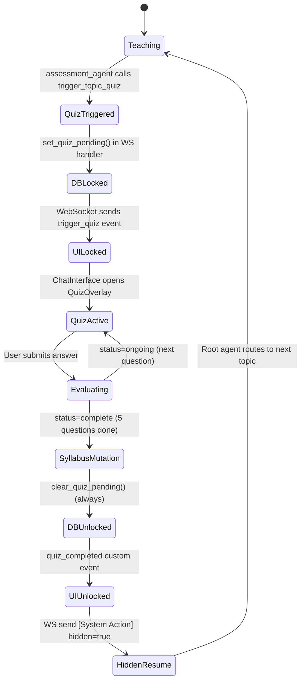

# AI Tutor: A Multi-Agent Intelligent Tutoring System with Enforced Mastery Progression

**Final Year Project Report**

**Submitted in partial fulfilment of the requirements for the degree of**
**Bachelor of Engineering / Bachelor of Technology in Computer Science & Engineering**

---

| | |
|---|---|
| **Student Name** | Ayan Bhunia |
| **Roll Number** | *(Enter Roll Number)* |
| **Department** | Computer Science & Engineering |
| **Academic Year** | 2025–2026 |
| **Project Guide** | *(Enter Guide Name)* |
| **Institution** | *(Enter Institution Name)* |

---

*"Education is not the filling of a pail, but the lighting of a fire."*
— William Butler Yeats

---

<div style="page-break-after: always;"></div>

---

## CERTIFICATE

This is to certify that the project work entitled **"AI Tutor: A Multi-Agent Intelligent Tutoring System with Enforced Mastery Progression"** has been carried out by **Ayan Bhunia** under my guidance in partial fulfilment of the requirements for the award of the degree of Bachelor of Technology in Computer Science & Engineering.

The project work is original and has not been submitted elsewhere for the award of any degree or diploma.

&nbsp;

**Project Guider**
*(Name, Designation, Department)*

&nbsp;

**Head of Department**
*(Name, Designation)*

&nbsp;

**External Examiner**
*(Name, Designation)*

---

<div style="page-break-after: always;"></div>

---

## DECLARATION

I hereby declare that the project work entitled **"AI Tutor: A Multi-Agent Intelligent Tutoring System with Enforced Mastery Progression"** submitted to *(Institution Name)* is a record of original work carried out by me under the supervision of *(Guide Name)*. The project has not been submitted elsewhere for any other degree or diploma.

&nbsp;

**Ayan Bhunia**
*(Roll Number)*
*(Date)*

---

<div style="page-break-after: always;"></div>

---

## ACKNOWLEDGEMENT

I wish to express my sincere gratitude to my project guide, *(Guide Name)*, for continuous support, valuable guidance, and encouragement throughout the duration of this project. Their expertise in intelligent systems and machine learning significantly shaped the design decisions documented in this report.

I am grateful to the faculty of the Department of Computer Science & Engineering for providing the infrastructure and academic environment required to undertake this research. I also acknowledge the open-source communities behind Google ADK, FastAPI, React, and the litellm library — without whose foundational work this project would not have been possible.

Finally, I thank my family and peers for their constant support.

&nbsp;

**Ayan Bhunia**

---

<div style="page-break-after: always;"></div>

---

## ABSTRACT

Online learning platforms have experienced unprecedented growth, yet a fundamental problem remains unsolved: learners routinely progress through course material without demonstrating genuine comprehension. Current platforms — from commercial MOOCs to general-purpose large language model (LLM) chat interfaces — either make assessments optional, or can be trivially bypassed through user manipulation. The result is passive consumption rather than verified learning.

This project presents the **AI Tutor**, a personalized, multi-agent Intelligent Tutoring System (ITS) built on a novel architecture that makes comprehension verification structurally mandatory. The system combines a dynamically generated, personalized syllabus with a five-layer quiz enforcement pipeline, per-question adaptive remediation, and a hierarchical multi-agent routing system that delivers pedagogically specialized instruction across multiple domains simultaneously.

The core technical contribution is a **quiz gatekeeping system enforced simultaneously at five independent layers**: the LLM agent prompt, the WebSocket protocol handler, the database `quiz_pending_module` flag, the REST API tool layer, and the client-side UI. This five-layer design makes it architecturally impossible to bypass a quiz checkpoint — even with direct API access or browser developer tools — while maintaining a fluid, real-time conversational interface.

The system is implemented using Google ADK for the agent orchestration layer, FastAPI with WebSocket streaming for the backend, React with Zustand for the frontend, SQLite with WAL mode for persistence, and litellm as a universal LLM bridge supporting both cloud APIs (Google Gemini) and fully offline local models (Ollama). The architecture is deliberately LLM-provider-agnostic, switching between providers through a single environment variable.

Key features include: (1) on-the-fly syllabus generation via multi-turn onboarding conversations, (2) real-time streaming dialogue through six specialist agents (theory, coding, math, visualization, search, assessment), (3) per-question granular remedial module injection into the live syllabus after quiz failure, (4) inline Mermaid.js diagram generation for visual concept explanation, and (5) database-persisted quiz state that survives page refreshes and browser crashes.

The system is grounded in established educational research — specifically Bloom's mastery learning model [B1], knowledge tracing theory [B4], the Cognitive Theory of Multimedia Learning [B13], and the effectiveness of formative feedback [B11] — providing both theoretical and empirical justification for each architectural decision.

**Keywords**: Intelligent Tutoring System, Multi-Agent System, Mastery Learning, Adaptive Remediation, Knowledge Tracing, Pedagogical Agents, WebSocket Streaming, Large Language Models, Google ADK, Formative Assessment.

---

<div style="page-break-after: always;"></div>

---

## TABLE OF CONTENTS

| Chapter | Title | Page |
|---|---|---|
| | Certificate | ii |
| | Declaration | iii |
| | Acknowledgement | iv |
| | Abstract | v |
| | Table of Contents | vi |
| | List of Figures | vii |
| | List of Tables | viii |
| **1** | **Introduction** | **1** |
| 1.1 | Background | 1 |
| 1.2 | Problem Statement | 2 |
| 1.3 | Motivation | 3 |
| 1.4 | Objectives | 4 |
| 1.5 | Scope of the Project | 5 |
| 1.6 | Organization of the Report | 5 |
| **2** | **Related Works** | **6** |
| 2.1 | Intelligent Tutoring Systems | 6 |
| 2.2 | Mastery Learning and Formative Assessment | 7 |
| 2.3 | Multi-Agent Systems in Education | 8 |
| 2.4 | Knowledge Tracing and Adaptive Learning | 9 |
| 2.5 | Multimedia Learning and Visualization | 10 |
| 2.6 | LLM-Based Educational Tools | 10 |
| 2.7 | Research Gap | 11 |
| **3** | **Proposed Work** | **12** |
| 3.1 | System Overview | 12 |
| 3.2 | Data Structures and Models | 13 |
| 3.3 | Data Processing Pipeline | 17 |
| 3.4 | System Architecture | 20 |
| 3.5 | Agent Layer Design | 26 |
| 3.6 | Frontend Design | 31 |
| 3.7 | Quiz Gatekeeping System | 35 |
| 3.8 | LLM Integration and Provider Switching | 38 |
| 3.9 | Implementation Environment | 39 |
| **4** | **Comparative Study** | **40** |
| 4.1 | Comparison with Commercial Platforms | 40 |
| 4.2 | Comparison with Classical ITS | 41 |
| 4.3 | Comparison with Modern LLM Tools | 42 |
| 4.4 | Feature Comparison Matrix | 43 |
| 4.5 | Academic Grounding | 44 |
| **5** | **Conclusion & Future Scope** | **47** |
| 5.1 | Conclusions | 47 |
| 5.2 | Limitations | 48 |
| 5.3 | Future Scope | 49 |
| | List of Publications | 51 |
| | References | 52 |

---

## LIST OF FIGURES

| Figure | Title |
|---|---|
| Fig 1.1 | The Problem: Passive Learning Loop in Existing Platforms |
| Fig 3.1 | High-Level System Architecture |
| Fig 3.2 | Repository Directory Structure |
| Fig 3.3 | Syllabus Data Model — JSON Schema Evolution |
| Fig 3.4 | Database Entity-Relationship Diagram |
| Fig 3.5 | Complete Data Flow — Onboarding to First Chat |
| Fig 3.6 | WebSocket Message Sequence Diagram |
| Fig 3.7 | Agent Hierarchy and Routing Table |
| Fig 3.8 | Five-Layer Quiz Enforcement Architecture |
| Fig 3.9 | Quiz State Machine |
| Fig 3.10 | Syllabus Mutation After Quiz Failure |
| Fig 3.11 | Frontend Component Hierarchy |
| Fig 4.1 | Feature Comparison Radar Chart (Qualitative) |

---

## LIST OF TABLES

| Table | Title |
|---|---|
| Table 3.1 | REST API Endpoint Reference |
| Table 3.2 | WebSocket Event Type Reference |
| Table 3.3 | Database Table Schema Summary |
| Table 3.4 | Agent Routing Table |
| Table 3.5 | LLM Provider Configuration Matrix |
| Table 4.1 | Feature Comparison Matrix |
| Table 4.2 | Academic Literature Mapping |

---

<div style="page-break-after: always;"></div>

---

# CHAPTER 1: INTRODUCTION

## 1.1 Background

The proliferation of online education platforms over the past decade has created unprecedented access to learning resources. Platforms such as Coursera, Khan Academy, edX, and Udemy collectively serve hundreds of millions of learners globally, offering structured video-based courses across virtually every academic and professional domain. The COVID-19 pandemic further accelerated this trend, normalizing remote and asynchronous learning as the default mode of instruction for millions of students.

Simultaneously, the emergence of large language models (LLMs) — particularly systems such as OpenAI's GPT-4, Google Gemini, and Meta's Llama — has created a new category of AI-powered educational tools. These general-purpose conversational systems can answer complex questions, explain abstract concepts, generate code, solve mathematical equations, and synthesize information across domains — all in natural language, instantly, and without requiring course enrollment or a human instructor.

Despite this technological abundance, a fundamental pedagogical problem persists: **learners can accumulate content exposure without accumulating genuine comprehension**. On video-based platforms, a student can watch an entire course at 2× speed, skip quizzes, and receive a certificate without ever internalizing the material. On general-purpose LLM tools like ChatGPT, a learner who struggles with a concept can simply ask the model to move on, and the model will comply — there is no structural mechanism to enforce understanding before progression.

This is not merely a theoretical concern. Research in cognitive psychology has consistently demonstrated that passive exposure to content, without active retrieval practice, produces substantially weaker long-term retention than instruction paired with mandatory testing (Roediger & Karpicke, 2006 [B3]). Bloom's foundational mastery learning framework (1968 [B1]) established that students need high criterion achievement on formative assessments before advancing to new material, and Black & Wiliam's landmark meta-analysis (1998 [B2]) showed formative assessment interventions produce effect sizes of 0.4–0.7σ — among the highest of any instructional intervention ever studied.

The gap between what educational research knows works, and what current technology delivers, motivates this project.

---

## 1.2 Problem Statement

The central problem addressed by this project can be stated precisely:

> **Current AI-powered learning tools lack a structurally enforced, multi-layer assessment checkpoint system that verifies comprehension before progression, dynamically adapts the curriculum based on per-question diagnostic evidence, and persists these adaptations across sessions.**

This problem has three distinct dimensions:

**1. Enforcement Gap**: Even when assessments exist, they are optional (commercial MOOCs), or can be bypassed through conversational manipulation (LLM chat tools). A learner can explicitly instruct ChatGPT "I don't want a quiz, just teach me the next topic" and the model will comply. No architectural enforcement exists.

**2. Granularity Gap**: When learners do fail assessments, most systems respond with a generic "review the material" suggestion. They do not identify *which specific subtopic* caused the failure, nor do they automatically insert targeted remedial content into the learning path at the exact position it is needed.

**3. Persistence Gap**: Quiz state and curriculum adaptation in LLM tools is entirely ephemeral. If a learner closes the browser mid-quiz, all context is lost. If they return to the learning platform the next day, there is no mechanism to restore the quiz state, re-lock the interface, and require completion before proceeding.

**Figure 1.1** illustrates the passive learning loop enabled by existing platforms:

```
┌─────────────────────────────────────────────────────────────┐
│              EXISTING PLATFORM LEARNING LOOP                │
│                                                             │
│  ┌─────────┐    ┌─────────┐    ┌──────────┐               │
│  │  Watch  │ →  │  Quiz?  │ →  │  SKIP ✓  │ (Optional)    │
│  │ Content │    │(Optional│    └──────────┘               │
│  └─────────┘    └─────────┘          │                     │
│       │                              │                     │
│       └──────────────────────────────┘                     │
│                     ↓                                      │
│              Next topic immediately                        │
│         (no comprehension verified)                        │
└─────────────────────────────────────────────────────────────┘
```

*Figure 1.1: The passive learning loop in existing platforms — assessments are optional and bypassed.*

---

## 1.3 Motivation

The motivation for this project emerges from two converging observations — one from educational research, one from software engineering.

**From educational research**: Six decades of scholarship in cognitive psychology and educational technology have produced a clear consensus: (1) spaced retrieval practice is one of the most effective learning strategies known to science [B3]; (2) mastery-based progression significantly outperforms time-based progression [B1]; (3) immediate, task-focused formative feedback is one of the highest-impact instructional interventions available [B2, B11]; and (4) visual representations combined with verbal explanations substantially improve comprehension and retention over text alone [B12, B13]. None of these findings are controversial, yet virtually no commercial learning platform fully implements all four simultaneously.

**From software engineering**: The emergence of modern LLM frameworks — particularly Google ADK with its native `transfer_to_agent` routing, litellm's universal LLM proxy, and FastAPI's async WebSocket support — has made it technically feasible to implement a genuinely adaptive, multi-agent tutoring system at low infrastructure cost. What previously required years of expert-authored knowledge bases (as in AutoTutor [B8] or the Cognitive Tutor [B5]) can now be accomplished with a combination of well-designed LLM prompts and a carefully engineered system architecture.

The convergence of research-backed pedagogy and accessible technology creates an opportunity: a system that **implements the best practices of educational research** (mastery learning, formative assessment, adaptive remediation, dual coding) in a **technically accessible, LLM-powered, open platform** that works for any subject without domain-specific knowledge engineering.

This project is the realization of that opportunity.

---

## 1.4 Objectives

The primary objectives of this project are:

1. **Design and implement a five-layer quiz enforcement system** that makes assessment completion structurally mandatory and impervious to client-side manipulation, prompt injection, and page refreshes.

2. **Build a dynamic syllabus generation engine** that creates personalized, subject-specific learning paths through multi-turn onboarding conversations, stored as mutable JSON in a persistent database.

3. **Develop a hierarchical multi-agent architecture** with six specialist agents (theory, coding, math, visualization, search, assessment), each optimized for a specific pedagogical role, routed by an orchestrator agent.

4. **Implement per-question granular remedial module injection** — mapping each wrong quiz answer to its specific subtopic and automatically inserting a targeted remedial module at the precise position in the syllabus.

5. **Create a real-time streaming conversational interface** via WebSocket, with streaming token delivery, routing status events, and UI state transitions driven by server-side events.

6. **Ensure LLM provider agnosticism** — the system must run identically with Google Gemini (cloud), OpenAI-compatible APIs, or fully offline with Ollama local models.

7. **Ground every architectural decision in peer-reviewed educational research** to produce a system that is not merely technically functional but pedagogically justified.

---

## 1.5 Scope of the Project

This project encompasses:
- Full-stack web application development (React + FastAPI)
- Multi-agent system design using Google ADK
- Database design and schema management (SQLite + SQLAlchemy)
- LLM prompt engineering for six distinct pedagogical roles
- Real-time WebSocket communication with event-driven UI
- Integration with multiple LLM providers via litellm

The project does **not** include:
- Mobile application development (though the API is mobile-ready)
- Production deployment infrastructure (Docker, Kubernetes, CI/CD)
- User study or empirical evaluation with real learners (future work)
- Formal security audit or penetration testing

---

## 1.6 Organization of the Report

The remainder of this report is organized as follows. **Chapter 2** reviews the relevant literature across six areas: intelligent tutoring systems, mastery learning, multi-agent systems, knowledge tracing, multimedia learning, and LLM-based tools. **Chapter 3** describes the proposed system in detail, covering data structures, processing pipelines, system architecture, agent design, frontend components, and the quiz enforcement system. **Chapter 4** provides a comprehensive comparative study against commercial platforms, classical ITS, and modern LLM tools, supported by academic literature. **Chapter 5** presents conclusions and future directions.

---

<div style="page-break-after: always;"></div>

# CHAPTER 2: RELATED WORKS

## 2.1 Intelligent Tutoring Systems

Intelligent Tutoring Systems (ITS) are computer-based educational systems that provide personalized instruction, feedback, and guidance without direct human teacher involvement. The field traces its origins to the 1970s with systems like SCHOLAR (Carbonell, 1970) — which could conduct Socratic dialogues about geography — and SOPHIE (Brown et al., 1982), which tutored electronics troubleshooting.

The defining characteristic of a classical ITS is a **four-component architecture**: (1) a domain model (what is known about the subject), (2) a student model (what the system believes the learner knows), (3) a pedagogical model (strategies for teaching), and (4) an interface. This four-component model, formalized by Wenger (1987), remains influential in ITS research.

**AutoTutor** (Graesser et al., 2004 [B8]) represented a major advance: it engaged learners in fully natural language dialogue, using latent semantic analysis to assess conceptual coverage. AutoTutor studies showed learning gains of approximately 0.8σ compared to reading text alone — approaching the 2σ advantage of human one-on-one tutoring documented by Bloom (1984). AutoTutor's modular internal architecture — curriculum scripts, expectation/misconception tailored dialogue, and discourse management — directly inspired the modular agent design of this project.

**Cognitive Tutor** (Koedinger et al., 1997 [B5]) took a different approach, modelling student learning as the acquisition of production rules and using Bayesian inference to estimate mastery of each rule. In classroom evaluations, Cognitive Tutor algebra students scored approximately 15% higher on standardized tests than peers using traditional instruction, with effect sizes of approximately 1.0σ. The knowledge tracing component of Cognitive Tutor directly inspired this project's per-question diagnostic approach to remedial injection.

The limitation of both systems is their **domain specificity**: building the knowledge base, dialogue scripts, or production rule models for a new domain requires substantial expert effort — months to years. This constraint has prevented classical ITS from scaling beyond well-resourced academic settings.

---

## 2.2 Mastery Learning and Formative Assessment

**Benjamin Bloom's mastery learning model** (1968 [B1]) proposed that virtually all students can achieve high levels of learning if given sufficient time and appropriate instructional support. The key mechanism is a **sequential test-feedback-correction cycle**: students study a unit, take a formative test, and — critically — must reach a defined mastery criterion (typically 80%) before advancing. Those who do not reach criterion receive corrective instruction tailored to their specific errors, then retest.

Bloom's model was motivated by his observation that traditional classroom instruction produces a roughly normal distribution of achievement, with approximately 1/3 of students failing to grasp each unit. His empirical results showed that mastery-based instruction could shift the distribution dramatically right, with most students achieving what was previously the level of only the top third.

**Black and Wiliam (1998 [B2])**, in their landmark review of 250+ studies, synthesized evidence on formative assessment — assessments designed to inform instructional decisions rather than rank students. They found formative assessment interventions consistently produced effect sizes of 0.4–0.7σ, concluding that improving the quality of classroom assessment offers one of the most productive routes to raising educational standards. Their work identified two critical properties: feedback must be *task-specific* (not generic praise or grades), and learners must be required to *act on the feedback* before moving on.

**Roediger and Karpicke (2006 [B3])** provided strong laboratory evidence for the "testing effect" — the finding that retrieving information from memory (via a test) strengthens memory far more than re-reading or restudying the same material. In their key experiment, subjects who took a test retained 50% more material one week later than those who restudied, despite having equal initial exposure time. This "test-enhanced learning" provides direct empirical justification for the mandatory quiz checkpoints in this project.

---

## 2.3 Multi-Agent Systems in Education

Multi-Agent Systems (MAS) are computational systems where multiple autonomous agents interact to achieve goals that may exceed any single agent's capabilities. The application of MAS to intelligent tutoring offers several advantages: **separation of concerns** (different agents handle different pedagogical roles), **parallel specialization** (each agent can be optimized for a specific task), and **composability** (new agents can be added without modifying existing ones).

**Lester et al. (1997 [B7])** introduced the concept of animated pedagogical agents — autonomous characters embedded in learning environments. Their "persona effect" study demonstrated that learners rated their learning experience significantly higher when accompanied by a lifelike pedagogical agent, and some conditions showed improved problem-solving. While the visual persona has limited relevance to a text-based system, the underlying finding — that distinct pedagogical roles positively impact learner experience — directly supports the multi-agent specialization in this project.

**Shazeer et al. (2017 [B9])** introduced the Mixture-of-Experts (MoE) architecture for neural networks: a learned gating network routes each input to a small subset of specialized expert sub-networks. This dramatically increases model capacity without proportional compute cost. While MoE is a machine learning architectural concept, it provides a compelling formal analogy for the hierarchical agent routing in this project: the root agent acts as a gating network, routing each user query to the most appropriate specialist agent.

Recent work has extended MAS principles specifically to LLM-based educational systems. Multi-agent LLM frameworks can distribute pedagogical functions across specialized models, enabling richer and more accurate instruction than any single model prompt could achieve. This project operationalizes this principle using Google ADK's `transfer_to_agent` mechanism.

---

## 2.4 Knowledge Tracing and Adaptive Learning

**Knowledge Tracing (KT)**, formalized by Corbett and Anderson (1994 [B4]), is the task of estimating a learner's evolving knowledge state over time, using their observed responses to exercises. Their Bayesian Knowledge Tracing (BKT) model represents the probability that a learner has mastered a skill as a hidden Markov model with four parameters: initial knowledge probability, learning rate, slip probability, and guess probability. BKT updates these estimates with each observed response, enabling the system to predict future performance and select appropriate exercises.

The influence of knowledge tracing on this project is significant: the `wrong_topics[]` array returned by the quiz engine is a simplified, rule-based form of skill-level mastery evidence. Each wrong answer is direct evidence that the learner has not yet mastered that specific subtopic, and the system responds by scheduling targeted remediation — exactly as BKT-informed systems do, though without the probabilistic model.

**Carlon and Cross (2021 [B6])** extended knowledge tracing with metacognitive inputs, combining self-reported confidence with observed correctness to estimate knowledge state. Their system showed that knowledge-tracing-driven adaptive content reduced cognitive overload and improved learning outcomes compared to non-adaptive systems. This motivates the design decision to inject *exactly* the subtopics that were wrong (not a general remedial unit) — reducing the cognitive burden of reviewing content that was already mastered.

---

## 2.5 Multimedia Learning and Visualization

**Paivio's Dual Coding Theory (1986 [B12])** posits that human cognition operates through two independent but interconnected systems: a verbal system (for language) and a nonverbal system (for imagery). Information encoded in both systems is more richly represented and more easily retrieved than information encoded in only one. This theory provides the fundamental justification for combining textual explanations with visual diagrams in the learning interface.

**Mayer's Cognitive Theory of Multimedia Learning (2009 [B13])** built on dual coding to identify 12 evidence-based principles for designing multimedia instructional materials. Key principles relevant to this project include: the **multimedia principle** (words + pictures produce better learning than words alone), the **contiguity principle** (words and pictures work best when presented together rather than separately), and the **coherence principle** (extraneous material should be eliminated to reduce cognitive load). The inline Mermaid.js diagram rendering in this project directly implements the contiguity principle — diagrams appear immediately adjacent to the textual explanation that prompted them.

**Alhassan and Uhomoibhi (2017 [B14])** specifically studied program visualization techniques — flowcharts, trace diagrams, and visual representations of algorithm execution — in K-12 programming education. Their results showed significant improvements in mental model accuracy and performance on programming tasks for students exposed to visualization tools compared to control groups. This directly motivates the dedicated `visualization_agent` for computer science topics.

---

## 2.6 LLM-Based Educational Tools

The application of Large Language Models to education represents the most recent wave of educational technology research. Early work demonstrated that GPT-3 and GPT-4 could provide useful explanations and feedback on a wide range of educational tasks (Kasneci et al., 2023). However, this early work also identified consistent limitations: LLM-based tutors lack persistent memory, cannot enforce assessment completion, and do not maintain structured representations of learner progress.

**Khan Academy's Khanmigo** (launched 2023) integrates GPT-4 as a conversational tutor within Khan Academy's existing exercise system. While Khanmigo can explain concepts conversationally, it relies on Khan Academy's pre-existing exercise bank for assessments and does not dynamically generate or restructure the curriculum based on learner performance.

**Duolingo Max** (2023) uses GPT-4 for language practice exercises, providing conversational practice contexts and explanation features. However, it is domain-specific (language learning) and does not implement mastery-based progression for arbitrary subjects.

**GitHub Copilot** and **Google's AlphaCode** apply LLMs to coding assistance but are not educational systems — they produce code directly rather than teaching the underlying concepts.

The common limitation across all existing LLM-based tools is the **absence of architecturally enforced pedagogical structure**. They are powerful conversational AI systems bolted onto education, not educational systems designed around research-backed pedagogy from the ground up.

---

## 2.7 Research Gap

The literature review reveals a clear gap at the intersection of several research areas:

| What Research Says Works | What Current Systems Deliver |
|---|---|
| Mastery-based gating (Bloom, 1968) | Optional quizzes or easily bypassed assessments |
| Per-skill remediation (Corbett & Anderson, 1994) | Generic "review the material" suggestions |
| Dialogue-based instruction (Graesser et al., 2004) | Fixed video lectures or undifferentiated chat |
| Specialist pedagogical roles (Lester et al., 1997) | Single monolithic model for all content types |
| Dual coding — verbal + visual (Paivio, 1986) | Text only, or static pre-authored diagrams |
| Immediate formative feedback (Shute, 2008) | Delayed or no per-item feedback |

**No existing open-source system combines all six**. This project addresses this gap by designing a system where each of these principles is implemented concretely, with explicit architectural decisions traceable to specific research findings.

---

<div style="page-break-after: always;"></div>

# CHAPTER 3: PROPOSED WORK

## 3.1 System Overview

The AI Tutor is a full-stack web application implementing a personalized, adaptive Intelligent Tutoring System. The system comprises three principal tiers:

1. **Frontend Tier**: A React single-page application (SPA) served from the same FastAPI process, communicating via REST and WebSocket.
2. **Backend Tier**: A FastAPI application handling all HTTP endpoints, WebSocket streaming, and database access.
3. **Agent Tier**: A Google ADK multi-agent system with six specialist agents, orchestrated by a root agent.

These tiers are connected by two communication channels: REST HTTP (for structured operations such as authentication, onboarding, and quiz submission) and WebSocket (for real-time bidirectional chat streaming).

```
┌────────────────────────────────────────────────────────────┐
│                    SYSTEM OVERVIEW                         │
│                                                            │
│  ┌──────────────────────────────────────────────────────┐  │
│  │              REACT FRONTEND (Browser)                │  │
│  │  Auth  │  Onboarding  │  Chat  │  Quiz  │  Sidebar  │  │
│  └────────────────────┬─────────────────────────────────┘  │
│                       │  REST + WebSocket                  │
│  ┌────────────────────▼─────────────────────────────────┐  │
│  │              FASTAPI BACKEND (:8000)                 │  │
│  │  REST Endpoints  │  WebSocket Handler  │  DB Layer   │  │
│  │  syllabus_engine │  quiz_engine        │  DBManager  │  │
│  └────────────────────┬─────────────────────────────────┘  │
│                       │  run_async() events                │
│  ┌────────────────────▼─────────────────────────────────┐  │
│  │            GOOGLE ADK AGENT LAYER                    │  │
│  │              root_agent (orchestrator)               │  │
│  │  theory │ coding │ math │ viz │ search │ assessment  │  │
│  └────────────────────┬─────────────────────────────────┘  │
│                       │  LLM API calls                     │
│  ┌────────────────────▼─────────────────────────────────┐  │
│  │              LLM INFRASTRUCTURE                      │  │
│  │   Google Gemini API    │    Ollama (local :11434)    │  │
│  └──────────────────────────────────────────────────────┘  │
└────────────────────────────────────────────────────────────┘
```

*Figure 3.1: High-level system architecture showing three tiers and communication channels.*

The system's core learning loop operates in four phases:

- **Phase 1 — Onboarding**: The user specifies their subject and skill level through a multi-turn conversational wizard. The `syllabus_engine` calls the LLM to generate a structured JSON syllabus, which is persisted to the database as a new `learning_paths` record.

- **Phase 2 — Teaching**: The user chats with the AI via WebSocket. The root agent routes each message to the appropriate specialist agent. The first message of each session receives the active syllabus as contextual context.

- **Phase 3 — Quiz Checkpoint**: After teaching a topic, the root agent transfers to `assessment_agent`, which calls `trigger_topic_quiz`. The WebSocket handler sets the `quiz_pending_module` DB flag and sends a `trigger_quiz` event to the frontend, which locks the chat input and opens the `QuizOverlay`.

- **Phase 4 — Syllabus Evolution**: The user answers 5 quiz questions via the `QuizOverlay`. On completion, `POST /api/quiz/answer` mutates the syllabus JSON — stamping `completed_topics[]` and injecting targeted `Remedial:` modules for each wrong answer. The quiz lock is cleared, and a hidden system message resumes the teaching loop.

---

## 3.2 Data Structures and Models

### 3.2.1 The Syllabus JSON — Primary Data Representation

The central data structure of the entire system is the **syllabus JSON object**, stored in the `learning_paths.syllabus` TEXT column. This is not a static document — it is a **mutable, evolving representation** of the learner's curriculum that changes after every quiz completion.

**Initial state** (from onboarding):
```json
{
  "modules": [
    {
      "title": "Module 1: Python Basics",
      "topics": [
        "Variables and Data Types",
        "Control Flow",
        "Functions"
      ]
    },
    {
      "title": "Module 2: Data Structures",
      "topics": [
        "Lists and Tuples",
        "Dictionaries",
        "Sets"
      ]
    }
  ]
}
```

**After first quiz completion** (topic stamped + remedial modules injected):
```json
{
  "modules": [
    {
      "title": "Module 1: Python Basics",
      "topics": ["Variables and Data Types", "Control Flow", "Functions"],
      "completed_topics": ["Module 1: Python Basics"]
    },
    {
      "title": "Remedial: Control Flow edge cases",
      "status": "pending",
      "topics": ["Review: Control Flow edge cases", "Practice exercises"],
      "subtopics": ["Review: Control Flow edge cases", "Practice exercises"]
    },
    {
      "title": "Remedial: Function scope rules",
      "status": "pending",
      "topics": ["Review: Function scope rules", "Practice exercises"],
      "subtopics": ["Review: Function scope rules", "Practice exercises"]
    },
    {
      "title": "Module 2: Data Structures",
      "topics": ["Lists and Tuples", "Dictionaries", "Sets"]
    }
  ]
}
```

*Figure 3.3: Syllabus data model showing JSON schema evolution from initial onboarding to post-quiz state with per-question remedial injection.*

This design enables several key behaviors:
- The AI agent can read the full learning context at session start by parsing the syllabus JSON
- The Sidebar component renders real-time progress by counting `completed_topics` vs. total modules
- Remedial modules appear immediately after the failed module in sequence, ensuring they are taught before advancing
- The `status: "pending"` field allows UI differentiation between regular and remedial modules

### 3.2.2 Database Schema

The database comprises four application tables plus ADK's internal session tables. All tables reside in a single `ai_tutor.db` SQLite file operating in Write-Ahead Logging (WAL) mode.

```
┌─────────────┐         ┌──────────────────────┐
│    users    │         │     interactions     │
│─────────────│ 1     * │──────────────────────│
│ user_id PK  │─────────│ id PK (autoincrement)│
│ name        │         │ session_id FK (idx)  │
│ created_at  │         │ user_id FK (idx)     │
└─────────────┘         │ agent_name           │
       │                │ query (TEXT)         │
       │ 1           *  │ response (TEXT)      │
       │                │ metadata_json        │
       ▼                │ timestamp            │
┌──────────────────┐    └──────────────────────┘
│  student_profiles│
│──────────────────│    ┌──────────────────────┐
│ id PK            │    │   learning_paths     │
│ user_id FK (idx) │    │──────────────────────│
│ subject          │    │ id PK                │
│ level            │    │ user_id FK (idx)     │
│ details (JSON)   │    │ session_id UNIQUE    │
│ updated_at       │    │ subject              │
└──────────────────┘    │ title                │
                        │ syllabus (TEXT/JSON) │
                        │ quiz_pending_module  │
                        │ created_at           │
                        └──────────────────────┘
```

*Figure 3.4: Database Entity-Relationship Diagram.*

**Table 3.3: Database Table Schema Summary**

| Table | Purpose | Key Columns |
|---|---|---|
| `users` | Identity store | `user_id PK`, `name`, `created_at` |
| `interactions` | Full chat history | `session_id`, `user_id`, `agent_name`, `query`, `response`, `metadata_json` |
| `student_profiles` | Per-subject skill tracking | `user_id`, `subject`, `level`, `details JSON` |
| `learning_paths` | Course records + live syllabus | `session_id UNIQUE`, `syllabus TEXT`, `quiz_pending_module TEXT` |

The `quiz_pending_module` column deserves special attention. It is the single source of truth for quiz state across the entire system. When non-NULL, it contains the topic name currently being quizzed, and this non-NULL state triggers hard enforcement at multiple system layers. It is set by `db_manager.set_quiz_pending()` and cleared by `db_manager.clear_quiz_pending()` — always called even in error paths to prevent permanent lock.

### 3.2.3 Pydantic Request/Response Models

The FastAPI backend uses Pydantic models for all request validation. These models provide automatic JSON parsing, type coercion, and OpenAPI documentation generation.

| Model | Fields | Endpoint |
|---|---|---|
| `LoginRequest` | `user_id: str` | `POST /api/auth/login` |
| `SignupRequest` | `user_id: str`, `name: str` | `POST /api/auth/signup` |
| `OnboardingChatRequest` | `user_id`, `answer`, `history[]` | `POST /api/paths/onboarding/chat` |
| `CreatePathRequest` | `user_id`, `session_id`, `subject`, `title`, `syllabus` | `POST /api/paths/create` |
| `QuizStartRequest` | `user_id`, `session_id`, `module_name?` | `POST /api/quiz/start` |
| `QuizAnswerRequest` | `user_id`, `session_id`, `history[]`, `answer`, `module_name?` | `POST /api/quiz/answer` |

### 3.2.4 Zustand State Store (Frontend)

The React frontend uses Zustand for global state management. The state shape is divided into **persisted** (surviving page refresh via `localStorage`) and **session-only** (in-memory, reset on refresh) fields:

```typescript
interface AppState {
  // Persisted via localStorage
  user: { user_id: string; name: string } | null;
  activePath: string | null;
  modelMode: 'local' | 'online';

  // Session-only (in memory)
  chatHistory: ChatMessage[];
  quizActive: boolean;
  quizModule: string | null;
  quizPreloadedData: any | null;
  activeQuizMsgId: string | null;
  quizRequired: boolean;  // Drives amber lock banner + input disabled state
}
```

The `quizRequired` field is particularly important: it is the frontend's representation of the server-side `quiz_pending_module` flag. It is set to `true` when the WebSocket receives `trigger_quiz` or `quiz_required` events, and cleared to `false` by `QuizOverlay.handleClose()` and the `quiz_completed` custom event listener.

---

## 3.3 Data Processing Pipeline

### 3.3.1 Onboarding Pipeline — Syllabus Generation

The onboarding pipeline converts a multi-turn conversation into a structured syllabus JSON. This is a **stateless process**: each call to `handle_onboarding_chat()` receives the full conversation history and current answer, reconstructs the full message context, calls the LLM, and returns a structured response. No intermediate state is stored server-side during onboarding.

```
User Answer
    │
    ▼
POST /api/paths/onboarding/chat
    │
    ▼
syllabus_engine.handle_onboarding_chat(history, answer)
    │
    ├─► Build messages array:
    │     [{role: "system", content: "curriculum designer prompt"},
    │      {role: "user", content: "What subject?"},
    │      {role: "assistant", content: "AI's previous question"},
    │      {role: "user", content: current_answer}]
    │
    ├─► litellm.completion(model, messages, temperature=0.7)
    │
    ├─► _extract_json(response.text)
    │     ├─ Pass 1: json.loads(text.strip())
    │     └─ Pass 2: re.search(r'\{.*\}', text, re.DOTALL)
    │
    ├─► status == "ongoing"?
    │     └─► return {status, question, options[]}
    │
    └─► status == "complete"?
          └─► return {status, subject, title, syllabus{modules[]}}
```

*Figure 3.5 (partial): Onboarding pipeline data flow.*

The LLM is prompted to act as a "curriculum designer" and ask targeted follow-up questions (typically 1–2) before generating the full structured syllabus. The system prompt explicitly instructs the LLM to return JSON in a specific schema, and the `_extract_json()` function handles the common case where models wrap JSON in markdown code fences.

**Fallback chain**: If `_extract_json()` returns `{}`, the caller falls back to `{status: "ongoing", question: "Could you elaborate on that?"}` — keeping the conversation alive without crashing.

### 3.3.2 Quiz Processing Pipeline

The quiz pipeline handles the 5-question assessment cycle. Unlike onboarding, the quiz pipeline involves two distinct stateless operations: **question generation** and **answer evaluation + next question generation**.

```
POST /api/quiz/start {module_name}
    │
    ▼
quiz_engine.generate_first_question(syllabus, topic_name)
    │
    ├─► Build focus prompt:
    │     "Focus ONLY on topic '{topic_name}'.
    │      Test knowledge specifically from this topic."
    │
    ├─► litellm.completion(model, prompt)
    │
    └─► Return: {question, type: "mcq"|"short_answer",
                 options: [...], topic: "..."}

─────────────────────────────────────────────────────────

POST /api/quiz/answer {history[], answer, module_name}
    │
    ▼
quiz_engine.evaluate_and_generate_next(syllabus, history, answer, topic_name)
    │
    ├─► Count questions in history
    │
    ├─► If count < 5:
    │     ├─► Evaluate latest answer (correct/incorrect)
    │     ├─► Generate next question (harder if correct, same/easier if wrong)
    │     └─► Return: {evaluation, is_correct, status:"ongoing", next_question{}}
    │
    └─► If count >= 5:
          ├─► Generate final_review
          │     ├─► score: "X/5"
          │     ├─► feedback: "Overall assessment..."
          │     ├─► wrong_topics[]: ["subtopic1", "subtopic2", ...]
          │     └─► needs_remedial: true/false
          └─► Return: {evaluation, is_correct, status:"complete", final_review{}}
```

### 3.3.3 Syllabus Mutation Pipeline

When `POST /api/quiz/answer` returns `status: "complete"`, the server executes the syllabus mutation pipeline. This is the most complex data transformation in the system:

```
quiz_answer() receives final_review
    │
    ▼
1. LOAD: db_manager.get_learning_paths() → fetch syllabus JSON string
    │
    ▼
2. PARSE: json.loads(syllabus_json)
    │     Handles multiple formats:
    │     - Array → use directly
    │     - {syllabus: [...]} → extract syllabus key
    │     - {modules: [...]} → use modules array
    │
    ▼
3. LOCATE: Find parent module matching req.module_name
    │     (fuzzy match on title or topic strings)
    │
    ▼
4. STAMP: module["completed_topics"].append(module_name)
    │
    ▼
5. INJECT REMEDIALS: For each topic in final_review.wrong_topics[]:
    │     insert {
    │       "title": f"Remedial: {topic}",
    │       "status": "pending",
    │       "topics": [f"Review: {topic}", "Practice exercises"],
    │       "subtopics": [f"Review: {topic}", "Practice exercises"]
    │     } at insert_idx + N (immediately after current module)
    │
    ▼
6. FALLBACK: If needs_remedial=True but wrong_topics=[]:
    │     insert single generic remedial using remedial_topic string
    │
    ▼
7. RE-WRAP: Reconstruct original JSON structure
    │
    ▼
8. PERSIST: db_manager.update_learning_path_details(session_id, json.dumps(syllabus))
    │
    ▼
9. CLEAR: db_manager.clear_quiz_pending(session_id)  ← ALWAYS, even on error
```

*Figure 3.10: Syllabus mutation pipeline — per-question remedial injection.*

The unconditional `clear_quiz_pending()` in step 9 is a critical safety design: even if steps 4–8 fail due to a parsing error, the quiz lock is released. This prevents a permanent dead-lock where a user's chat would be locked forever due to a malformed syllabus.

### 3.3.4 WebSocket Message Processing Pipeline

Each incoming WebSocket message goes through the following processing pipeline:

```
WebSocket.receive_text() → parse JSON → {prompt, hidden}
    │
    ▼
[GATE 1] hidden=False?
    ├─► YES: db_manager.get_quiz_pending(session_id)
    │     ├─► Non-NULL → send {type:"quiz_required", module:...}
    │     │              send {type:"done"}
    │     │              continue (DROP MESSAGE)
    │     └─► NULL → proceed
    │
    ▼
[LOG] hidden=False → db_manager.log_interaction(user_id, session_id, "user", prompt)
    │
    ▼
[INJECT] first_message? → prepend "[System: Active Syllabus context:\n{json}]\n\n"
    │
    ▼
runner.run_async(user_id, session_id, new_message)
    │
    ▼
async for event in runner.run_async():
    │
    ├─► get_function_calls() → for each call:
    │     ├─► "transfer_to_agent" → send {type:"status", "Consulting X..."}
    │     ├─► "trigger_topic_quiz" → db_manager.set_quiz_pending(session_id, name)
    │     │                        → send {type:"status", "Preparing Mandatory Quiz..."}
    │     │                        → send {type:"trigger_quiz", module:name}
    │     └─► other → send {type:"status", "Running {tool_name}..."}
    │
    └─► event.content.parts → for each part with part.text:
          └─► send {type:"chunk", content:part.text, author:event.author}
    │
    ▼
send {type:"done"}
    │
    ▼
[LOG] hidden=False → db_manager.log_interaction(user_id, session_id, agent_name, response)
```

*Figure 3.6: WebSocket message processing pipeline.*

---

## 3.4 System Architecture

### 3.4.1 Repository Structure

The project is organized into three primary directories corresponding to the three tiers:

```
AI-Tutor/
├── ai_tutor_agent/               # Google ADK agent package
│   ├── agent.py                  # Root orchestrator agent
│   ├── adk.yaml                  # ADK application config
│   ├── .env                      # AGENT_MODEL, GOOGLE_API_KEY
│   ├── shared_tools/
│   │   ├── db_tools.py           # FunctionTools: history, quiz enforcement
│   │   └── path_tools.py         # FunctionTools: create_path, trigger_quiz
│   ├── subagents/
│   │   ├── assessment_agent/agent.py
│   │   ├── coding_agent/agent.py
│   │   ├── math_agent/agent.py
│   │   ├── theory_agent/agent.py
│   │   ├── visualization_agent/agent.py
│   │   └── search_agent/agent.py
│   └── utils/
│       ├── db_manager.py         # SQLAlchemy singleton, WAL mode
│       ├── llm_config.py         # Gemini native vs LiteLLM selector
│       └── response_parser.py    # JSON-unwrapper (legacy)
│
├── fastapi_app/
│   ├── main.py                   # All REST endpoints + WebSocket handler
│   ├── quiz_engine.py            # 5-question quiz via litellm (topic-focused)
│   └── syllabus_engine.py        # Multi-turn onboarding via litellm
│
├── frontend/src/
│   ├── App.tsx                   # Root: auth guard + layout shell
│   ├── store/store.ts            # Zustand global state
│   └── components/
│       ├── AuthView.tsx
│       ├── OnboardingModal.tsx
│       ├── Sidebar.tsx
│       ├── ChatInterface.tsx     # WebSocket chat + streaming
│       ├── QuizOverlay.tsx       # Full-screen quiz modal
│       └── UserProfile.tsx
│
├── ai_tutor.db                   # SQLite database (WAL mode)
├── requirements.txt
├── requirements-freeze.txt       # Pinned dependency snapshot
├── test_curl.py                  # Dev helper: /api/quiz/start
├── test_quiz.py                  # Dev helper: generate_first_question
└── debug_runner.py               # Standalone ADK CLI runner
```

*Figure 3.2: Repository directory structure.*

### 3.4.2 REST API Endpoint Reference

**Table 3.1: Complete REST API Endpoint Reference**

| Method | Path | Handler Function | Description |
|---|---|---|---|
| `POST` | `/api/auth/login` | `login()` | Look up user by `user_id`. Returns 404 if not found. |
| `POST` | `/api/auth/signup` | `signup()` | Create new user. Returns 400 on duplicate `user_id`. |
| `POST` | `/api/auth/guest` | `guest_login()` | Auto-generate `guest_{8hex}` ID and credentials. |
| `GET` | `/api/paths` | `get_paths()` | All learning paths for `?user_id`. |
| `GET` | `/api/paths/{session_id}` | `get_path_details()` | Single path with profile + parsed syllabus. |
| `POST` | `/api/paths/onboarding/start` | `onboarding_start()` | Return first question + subject options array. |
| `POST` | `/api/paths/onboarding/chat` | `onboarding_chat()` | Proxy to `syllabus_engine.handle_onboarding_chat()`. |
| `POST` | `/api/paths/create` | `create_path()` | Create learning path row + store syllabus JSON. |
| `GET` | `/api/quiz/pending` | `quiz_pending()` | Check `quiz_pending_module` column. For page refresh recovery. |
| `POST` | `/api/quiz/start` | `quiz_start()` | Set quiz flag, call `generate_first_question(topic_name)`. |
| `POST` | `/api/quiz/answer` | `quiz_answer()` | Evaluate answer, mutate syllabus, clear quiz lock. |
| `GET` | `/api/chat/history/{session_id}` | `get_chat_history()` | Return interactions table rows for session. |
| `POST` | `/api/chat/settings/model` | `update_model_settings()` | UI-only model toggle acknowledgment. |
| `WebSocket` | `/ws/chat/{session_id}` | `websocket_chat()` | Bidirectional chat streaming handler. |

### 3.4.3 WebSocket Event Protocol

**Table 3.2: WebSocket Event Type Reference**

| Direction | Event Type | Payload | Purpose |
|---|---|---|---|
| Server → Client | `chunk` | `{type, content, author}` | Streaming text token from active agent |
| Server → Client | `status` | `{type, content}` | Agent routing update ("Consulting Coding Agent...") |
| Server → Client | `trigger_quiz` | `{type, module}` | Quiz checkpoint fired; lock UI and pre-fetch first question |
| Server → Client | `quiz_required` | `{type, module, content}` | Server rejected message — quiz still pending |
| Server → Client | `done` | `{type}` | Current agent turn complete |
| Client → Server | *(any)* | `{prompt, hidden?}` | User message or hidden system action |

The `hidden` flag deserves detailed explanation. When `hidden: true`, the WebSocket handler:
1. Skips the `quiz_pending_module` check (allowing the system message to reach the LLM even during quiz state)
2. Skips logging to the `interactions` table

This is used exclusively for the `[System Action]` message sent after quiz completion — a system-generated prompt that resumes the tutor without appearing in chat history or triggering another quiz lock check.

### 3.4.4 Application Startup Sequence

The FastAPI application follows a specific initialization sequence:

```python
@asynccontextmanager
async def lifespan(app: FastAPI):
    # 1. Initialize ADK session tables in SQLite
    try:
        await session_service.init_db()
    except AttributeError:
        pass  # Handles older ADK versions
    yield
    # (No explicit teardown required)

app = FastAPI(title="AI Tutor API", lifespan=lifespan)

# 2. Mount compiled React SPA as static files
app.mount("/app", StaticFiles(directory="frontend/dist", html=True), name="frontend")

# 3. CORS configuration (development: allow all origins)
app.add_middleware(CORSMiddleware, allow_origins=["*"], ...)

# 4. Root redirect → SPA
@app.get("/")
async def root():
    return RedirectResponse("/app/index.html")
```

This startup sequence ensures that ADK's session tables exist before any WebSocket connection attempts to use them, and that the compiled SPA is served from the same Uvicorn process — eliminating the need for a separate web server in development.

### 3.4.5 Database Manager — Singleton with WAL Mode

The `DBManager` class implements the Singleton pattern using Python's `__new__`:

```python
class DBManager:
    _instance = None

    def __new__(cls):
        if cls._instance is None:
            cls._instance = super().__new__(cls)
            # Initialize engine ONCE
            engine = create_engine(DATABASE_URI)
            # Apply WAL PRAGMAs on every new connection
            @event.listens_for(engine, "connect")
            def set_sqlite_pragma(connection, _):
                cursor = connection.cursor()
                cursor.execute("PRAGMA journal_mode=WAL")
                cursor.execute("PRAGMA synchronous=NORMAL")
                cursor.execute("PRAGMA cache_size=-64000")  # 64 MB
                cursor.execute("PRAGMA temp_store=MEMORY")
                cursor.close()
            # Create tables + run migrations
            Base.metadata.create_all(engine)
            cls._instance._check_and_migrate()
        return cls._instance
```

The four PRAGMAs applied to every SQLite connection serve specific performance and correctness purposes:

| PRAGMA | Value | Purpose |
|---|---|---|
| `journal_mode` | `WAL` | Allow concurrent reads during writes — essential for WebSocket chat |
| `synchronous` | `NORMAL` | Reduce fsync overhead; safe under WAL mode |
| `cache_size` | `-64000` | 64 MB page cache in RAM — reduces disk I/O |
| `temp_store` | `MEMORY` | Temporary tables in RAM — faster sorting and joins |

The `_check_and_migrate()` method handles schema evolution without a formal migration tool, using `try/except` around `ALTER TABLE ... ADD COLUMN` statements — safe because SQLite raises an error on duplicate column names which is caught and ignored.

---

## 3.5 Agent Layer Design

### 3.5.1 Root Agent Architecture

The root agent is the central orchestrator of the entire teaching system. It is defined as:

```python
root_agent = Agent(
    name="ai_tutor",
    model=get_model(),                    # Gemini or LiteLlm wrapper
    generate_content_config=get_retry_config(),  # 15 retries, 2s initial
    sub_agents=[
        theory_agent,
        coding_agent,
        math_agent,
        assessment_agent,
        visualization_agent,
        search_agent
    ],
    tools=[
        get_user_history,
        create_learning_path_tool,
        get_learning_paths_tool,
        get_current_learning_path_context,
        update_learning_path_details
    ]
)
```

The root agent's instruction prompt contains explicit, rule-based routing logic:

**Table 3.4: Agent Routing Table**

| Input Type | Routed To | Rationale |
|---|---|---|
| Theory, concepts, history, explanations | `theory_agent` | Structured explanation + analogies |
| Code, algorithms, DSA, debugging | `coding_agent` | Complexity analysis + edge cases |
| Mathematics, proofs, equations | `math_agent` | LaTeX formatting + step derivations |
| Quiz checkpoint needed | `assessment_agent` | Single tool: `trigger_topic_quiz` |
| Diagrams, flowcharts, state machines | `visualization_agent` | Mermaid.js syntax generation |
| Current events, web information | `search_agent` | `google_search` or mock fallback |
| Simple greetings, meta questions | *(root agent itself)* | Text response, no transfer |

**Critical root agent rules** (from instruction prompt):
1. **One action per turn**: ONE tool call OR ONE `transfer_to_agent` OR text response — never two of these in the same turn
2. **No chaining after transfer**: After a specialist completes, output their text and stop — do NOT transfer again in the same turn
3. **Mandatory quiz**: After ANY teaching specialist responds with educational content, MUST transfer to `assessment_agent`
4. **System Action handling**: On `[System Action]` messages (quiz completion confirmations), route to next teaching agent — do NOT re-trigger assessment
5. **Remedial-first**: If remedial modules exist in the syllabus, teach them before advancing to the next primary module

```
┌────────────────────────────────────────────────────────────┐
│                   ROOT AGENT (Orchestrator)                │
│                                                            │
│   User Message → Route Decision                           │
│         │                                                  │
│    ┌────┴──────────────────────────────────────────┐      │
│    │                                               │      │
│    ▼           ▼           ▼          ▼            ▼      │
│ theory_    coding_      math_    visualization_  search_  │
│  agent      agent       agent       agent        agent   │
│ (terminal)(terminal) (terminal)   (terminal)  (1 tool)  │
│                                                           │
│                      ▼                                    │
│              assessment_agent (1 tool: trigger_topic_quiz)│
└────────────────────────────────────────────────────────────┘
```

*Figure 3.7: Agent hierarchy and routing. Terminal agents (no tools, no sub-agents) can only respond with text.*

### 3.5.2 Terminal Agent Design

Four of the six specialist agents are **terminal agents** — they have no `sub_agents` list and no `tools`. They can only respond with text. This is an intentional capability-limiting design:

**Why terminal agents?**
- **Safety**: A terminal coding agent cannot accidentally call `trigger_topic_quiz`, preventing double quiz triggers
- **Clarity**: Each agent has exactly one job; the routing decision is clear and auditable
- **Reliability**: Agents without tools cannot enter tool-call loops or fail on tool errors

Each terminal agent has a focused instruction prompt:

**`theory_agent`** instruction key points:
- Break down concepts using analogies and structured explanations
- Use bullet points, headers, and examples
- Do NOT ask if the user is ready for a quiz — the system handles this automatically
- Do NOT use `transfer_to_agent` or call tools — TEXT ONLY

**`coding_agent`** instruction key points:
- Write clean, documented code with Time/Space complexity analysis
- Explain each code section step-by-step
- Cover edge cases and best practices
- NEVER ask about quizzes; you are a terminal agent, TEXT ONLY

**`math_agent`** instruction key points:
- State the theorem/formula before applying it
- Show step-by-step derivation with clear intermediate steps
- Use LaTeX-style math notation (`$...$` for inline, `$$...$$` for display)
- Terminal agent rules apply

**`visualization_agent`** instruction key points:
- Generate Mermaid.js diagram code only (no explanation needed unless requested)
- Choose the most appropriate diagram type: `graph TD` for flowcharts, `sequenceDiagram` for protocols, `stateDiagram-v2` for state machines, `erDiagram` for database schemas
- Critical syntax rules: Node IDs must use underscores, not spaces (`Module_1` not `Module 1`); subgraph syntax requires `subgraph ID [Label]`

### 3.5.3 Assessment Agent — The Quiz Enforcer

The assessment agent is architecturally unique: it is non-terminal (has one tool) but has a very limited scope:

```python
assessment_agent = Agent(
    name="assessment_agent",
    model=get_model(),
    tools=[trigger_topic_quiz],  # ONLY tool
    instruction="""
    Your ONLY job is to call trigger_topic_quiz(topic_name).
    
    IMPORTANT ESCAPE HATCH:
    If the incoming message starts with '[System Action]' (quiz completion),
    you MUST NOT trigger a quiz. Respond ONLY with:
    "Quiz sequence finished. Returning to tutor."
    
    For all other messages: call trigger_topic_quiz immediately.
    """
)
```

The escape hatch is critical for preventing infinite loops. Without it:
1. Root agent sends `[System Action]` to assessment_agent
2. Assessment agent triggers a new quiz
3. User completes new quiz
4. System sends another `[System Action]`
5. Assessment agent triggers another quiz → infinite loop

### 3.5.4 The `trigger_topic_quiz` Function — Critical Design

```python
def trigger_topic_quiz(topic_name: str, tool_context: ToolContext) -> dict:
    """
    Signals that a mandatory quiz should be triggered for the given topic.
    
    This function's RETURN VALUE is informational only.
    The real action happens in FastAPI's WebSocket handler,
    which intercepts this FUNCTION CALL EVENT in the ADK event stream
    and directly calls db_manager.set_quiz_pending().
    """
    return {
        "status": "quiz_triggered",
        "message": f"A mandatory quiz for '{topic_name}' has been activated.",
        "_internal_action": "open_quiz"
    }
```

The subtle but important point: **FastAPI intercepts the function call event, not the return value**. When the ADK event stream yields an event with `get_function_calls()` returning a call named `trigger_topic_quiz`, the WebSocket handler:
1. Extracts `topic_name` from `call.args`
2. Calls `db_manager.set_quiz_pending(session_id, topic_name)` directly
3. Sends `{type: "status", content: "Preparing Mandatory Quiz for {topic_name}..."}` to the client
4. Sends `{type: "trigger_quiz", module: topic_name}` to the client

This design means the quiz lock is set at the infrastructure layer (FastAPI + DB), not at the agent layer — making it impervious to LLM hallucinations about whether the tool actually ran.

### 3.5.5 `update_learning_path_details` — Quiz Enforcement Gateway

This tool, available to the root agent for syllabus management, contains an embedded quiz enforcement check:

```python
def update_learning_path_details(syllabus: str, level: str, tool_context: ToolContext) -> dict:
    # 1. Parse new syllabus to find new current_topic
    new_topic = json.loads(syllabus).get("current_topic")
    
    # 2. Fetch old syllabus from DB
    old_syllabus = db_manager.get_learning_paths(session_id)
    old_topic = json.loads(old_syllabus).get("current_topic")
    
    # 3. If trying to advance topics...
    if old_topic != new_topic:
        # 4. Check if old_topic was quizzed
        for module in all_modules:
            if old_topic in module.get("completed_topics", []):
                break  # OK to advance
        else:
            # 5. REJECT the update
            return {
                "error": f"ERROR: Mandatory Quiz Checkpoint! "
                         f"You MUST trigger the quiz for '{old_topic}' "
                         f"using trigger_topic_quiz before moving to '{new_topic}'. "
                         f"Update rejected."
            }
    
    # 6. If check passes, persist
    db_manager.update_learning_path_details(session_id, syllabus)
```

This tool-level enforcement is Layer 3 of the five-layer quiz gatekeeping system. Even if the root agent attempts to advance the current topic without triggering a quiz, this tool returns an error string that goes back to the agent as a tool result — forcing the agent to call `trigger_topic_quiz` before retrying.

### 3.5.6 Search Agent — Graceful Degradation

The search agent handles real-time information queries. Its tool configuration is determined at module-load time:

```python
model_val = get_model()
tools_list = []

if "gemini" in str(model_val).lower():
    from google.adk.tools import google_search
    tools_list.append(google_search)
else:
    # Offline mode: mock search to avoid API errors
    def web_search(query: str) -> str:
        return (f"Mock search result for '{query}'. "
                f"Web search is disabled for local models. "
                f"Please answer from training knowledge.")
    tools_list.append(FunctionTool(web_search))

search_agent = Agent(name="search_agent", tools=tools_list, ...)
```

This design ensures the system works correctly in offline mode (Ollama) without crashing, while providing full web search capability when using Gemini.

---

## 3.6 Frontend Design

### 3.6.1 Component Architecture

The React frontend is organized as a component hierarchy driven by Zustand state:

```
App.tsx (auth guard + layout shell)
│
├─► if user == null: <AuthView />
│
└─► if user != null:
    ├─► <Sidebar onNewChat={...} />
    ├─► <main>
    │     ├─► <header><UserProfile /></header>
    │     ├─► <ChatInterface />
    │     └─► <QuizOverlay />  ← always mounted, renders null when inactive
    └─► {showOnboarding && <OnboardingModal />}
```

*Figure 3.11: Frontend component hierarchy.*

The key design decisions:
- `QuizOverlay` is **always mounted** — this avoids mount/unmount animation issues and allows it to pre-load quiz data. It renders `null` when `quizActive === false`.
- `showOnboarding` is **local React state** in `App.tsx` (not Zustand) because it is a transient UI toggle with no cross-component relevance.
- `ChatInterface` and `QuizOverlay` communicate via **DOM custom events** (`quiz_completed`, `path_updated`) rather than shared Zustand state, avoiding the need to lift state to `App.tsx`.

### 3.6.2 ChatInterface — WebSocket Management

`ChatInterface.tsx` is the most complex frontend component. Its core responsibilities:

**WebSocket lifecycle** (`useEffect` on `[activePath, user]`):
```typescript
useEffect(() => {
  if (!activePath || !user) return;

  // 1. Fetch chat history
  fetch(`/api/chat/history/${activePath}`).then(...)

  // 2. Open WebSocket
  const ws = new WebSocket(`ws://host/ws/chat/${activePath}?user_id=${user.user_id}`);
  wsRef.current = ws;

  ws.onmessage = (event) => {
    const data = JSON.parse(event.data);
    switch(data.type) {
      case 'chunk':    updateLastMessage(data.content); break;
      case 'status':   setStreamingStatus(data.content); break;
      case 'done':     setIsStreaming(false); break;
      case 'trigger_quiz':
        setQuizRequired(true);
        // Pre-fetch first question
        fetch('/api/quiz/start', {...}).then(firstQ => {
          setQuizPreloadedData(firstQ);
          setQuizState(true, data.module, msgId);
        });
        break;
      case 'quiz_required':
        setQuizRequired(true);
        break;
    }
  };

  // 3. Check for pending quiz (page refresh recovery)
  fetch(`/api/quiz/pending?session_id=${activePath}`).then(data => {
    if (data.pending) {
      setQuizRequired(true);
      // Re-fetch first question and restore quiz overlay
      ...
    }
  });

  return () => ws.close();  // Cleanup on unmount or path change
}, [activePath, user]);
```

**Quiz lock banner**: When `quizRequired === true`, an amber animated banner renders above the chat input:
```tsx
{quizRequired && (
  <div className="flex items-center gap-3 px-4 py-3 bg-amber-500/10 
                   border border-amber-500/30 rounded-xl text-amber-400 
                   text-sm font-medium animate-pulse">
    <span>🔒</span>
    <span>Complete the mandatory quiz to unlock the chat and continue learning.</span>
  </div>
)}
<input
  placeholder={quizRequired ? '🔒 Complete the quiz to continue...' : 'Ask a question...'}
  className={quizRequired ? 'border-amber-500/50 cursor-not-allowed' : 'border-zinc-800'}
  disabled={isStreaming || quizRequired}
/>
```

### 3.6.3 QuizOverlay — Full-Screen Assessment Interface

`QuizOverlay.tsx` is a full-screen blocking modal rendered over the chat interface during a quiz. Its state machine:

```
┌─────────────────────────────────────────────────────────┐
│                 QuizOverlay State Machine               │
│                                                         │
│  [loading] ──────► [active]                            │
│     │                 │                                │
│     │ quizPreloadedData  │ user submits answer          │
│     │ OR /api/quiz/start │                              │
│     │                 ▼                                │
│     │            [evaluating]                          │
│     │             │        │                           │
│     │    status=ongoing  status=complete               │
│     │             ▼        ▼                           │
│     │          [active] [complete]                     │
│     └──────────────────────┘                           │
└─────────────────────────────────────────────────────────┘
```

*Figure 3.9: Quiz state machine.*

Key UI behaviors:
- **Close button hidden** until `status === 'complete'` — users cannot dismiss mid-quiz
- **MCQ**: Radio-style option buttons with selection highlight
- **Short answer**: `<textarea>` with auto-resize
- **Evaluating state**: Submit button shows spinner, feedback banner (green = correct, red = incorrect) shown for 3 seconds before next question
- **Complete state**: Score circle (e.g., "3/5"), feedback text, and if `wrong_topics.length > 0`: an amber remedial topics list with bullet dots, one per wrong subtopic

### 3.6.4 Mermaid Diagram Rendering

The `MermaidRenderer` component converts diagram code to rendered images without the mermaid.js client library:

```typescript
const MermaidRenderer = ({ chart }) => {
  const [hasError, setHasError] = useState(false);

  const state = { code: chart, mermaid: { theme: 'dark' } };
  const b64 = btoa(unescape(encodeURIComponent(JSON.stringify(state))));
  const src = `https://mermaid.ink/img/${b64}`;

  if (hasError) {
    return (
      <>
        <div className="text-amber-400">⚠ Diagram render failed</div>
        <pre>{chart}</pre>  {/* Fallback: show raw code */}
      </>
    );
  }

  return (
     setHasError(true)}
      onClick={() => setLightboxSrc(src)}  // Click-to-zoom
      alt="Generated diagram"
    />
  );
};
```

The ReactMarkdown custom renderer detects `language-mermaid` code blocks and replaces them with `<MermaidRenderer>`:

```typescript
const markdownComponents = {
  code({ className, children, inline }) {
    if (!inline && className?.includes('language-mermaid')) {
      return <MermaidRenderer chart={String(children)} />;
    }
    return <SyntaxHighlighter language={...}>{children}</SyntaxHighlighter>;
  }
};
```

### 3.6.5 OnboardingModal — Multi-Step Wizard

The `OnboardingModal` implements a full-screen wizard that guides users through curriculum creation:

1. **Mount**: Calls `POST /api/paths/onboarding/start` → receives first question + subject option chips
2. **Option chip click or text input**: Calls `POST /api/paths/onboarding/chat` → receives `{status, question, options}` or `{status: "complete", syllabus, subject, title}`
3. **Syllabus preview**: When `status === "complete"`, renders scrollable module list with topic counts before "Create Path & Start Learning" button
4. **Path creation**: Generates `session_id = "path_${Date.now()}"`, calls `POST /api/paths/create`, then `setActivePath(sessionId)` — closes modal and opens chat

---

## 3.7 Quiz Gatekeeping System

The five-layer quiz enforcement system is the primary technical contribution of this project. Each layer provides independent enforcement, so defeating any single layer does not bypass the checkpoint.

```
┌──────────────────────────────────────────────────────────────┐
│           FIVE-LAYER QUIZ ENFORCEMENT ARCHITECTURE          │
│                                                              │
│  Layer 1: LLM Prompt (Soft)                                 │
│  ┌──────────────────────────────────────────────────────┐   │
│  │ Root agent instruction: "After ANY teaching response, │   │
│  │ MUST transfer to assessment_agent immediately."       │   │
│  └──────────────────────────────────────────────────────┘   │
│                          ↓                                   │
│  Layer 2: WebSocket Server-Side Block (Hard)                 │
│  ┌──────────────────────────────────────────────────────┐   │
│  │ Before EVERY message (if not hidden):                │   │
│  │ if db.get_quiz_pending(session_id) is not None:       │   │
│  │     send quiz_required event; DROP MESSAGE; continue  │   │
│  └──────────────────────────────────────────────────────┘   │
│                          ↓                                   │
│  Layer 3: Tool-Level API Rejection                           │
│  ┌──────────────────────────────────────────────────────┐   │
│  │ update_learning_path_details() checks completed_      │   │
│  │ topics[] before allowing current_topic advancement.  │   │
│  │ Returns error string if quiz not completed.          │   │
│  └──────────────────────────────────────────────────────┘   │
│                          ↓                                   │
│  Layer 4: Client-Side UI Lock                                │
│  ┌──────────────────────────────────────────────────────┐   │
│  │ disabled={isStreaming || quizRequired}               │   │
│  │ Amber banner + amber border + changed placeholder    │   │
│  └──────────────────────────────────────────────────────┘   │
│                          ↓                                   │
│  Layer 5: Page Refresh Recovery                              │
│  ┌──────────────────────────────────────────────────────┐   │
│  │ GET /api/quiz/pending on reconnect                   │   │
│  │ If non-null: restore QuizOverlay + re-lock input     │   │
│  └──────────────────────────────────────────────────────┘   │
└──────────────────────────────────────────────────────────────┘
```

*Figure 3.8: Five-layer quiz enforcement architecture.*

### 3.7.1 Layer 1 — LLM Prompt Enforcement

The root agent's instruction contains an explicit mandatory routing rule:

> "MANDATORY QUIZ CHECKPOINT: After ANY teaching agent (theory, coding, math, or visualization) has responded to a user query with educational content, you MUST immediately transfer to assessment_agent on your next turn. This is non-negotiable. Do NOT skip this step."

This is a **soft enforcement** — it relies on the LLM following its instructions. While GPT-4 and Gemini are generally reliable at following such rules, prompt injection ("ignore all previous instructions") or hallucination could theoretically bypass this layer alone. The remaining four layers provide the hard enforcement.

### 3.7.2 Layer 2 — WebSocket Server-Side Hard Block

This is the most robust enforcement layer. The server-side check runs *before* any message reaches the LLM:

```python
@app.websocket("/ws/chat/{session_id}")
async def websocket_chat(websocket, session_id, user_id):
    await websocket.accept()
    
    while True:
        data = await websocket.receive_text()
        parsed = json.loads(data)
        prompt = parsed.get("prompt", "")
        hidden = parsed.get("hidden", False)

        if not prompt:
            continue

        # SERVER-SIDE QUIZ ENFORCEMENT
        if not hidden:
            pending_module = db_manager.get_quiz_pending(session_id)
            if pending_module:
                await websocket.send_json({
                    "type": "quiz_required",
                    "module": pending_module,
                    "content": f"Complete the quiz for '{pending_module}' first."
                })
                await websocket.send_json({"type": "done"})
                continue  # Drop message — never reaches ADK runner
```

This check cannot be bypassed by any client-side action. Even if a user connects directly with a WebSocket client library and sends messages manually, the server will drop them and return `quiz_required` as long as `quiz_pending_module` is set in the DB.

### 3.7.3 Quiz State Machine — Full Flow



*Figure 3.9: Complete quiz state machine from trigger to resume.*

---

## 3.8 LLM Integration and Provider Switching

The system supports multiple LLM providers through a unified interface:

**Table 3.5: LLM Provider Configuration Matrix**

| `AGENT_MODEL` Value | Provider | ADK Behavior | Notes |
|---|---|---|---|
| `gemini-2.5-flash` | Google Gemini | Native ADK connector | Default. 15-retry config enabled. |
| `gemini-2.0-flash-lite` | Google Gemini | Native ADK connector | Faster/cheaper alternative. |
| `ollama/llama3.1` | Local Ollama | LiteLlm wrapper | Routes to `localhost:11434`. Offline. |
| `ollama/mistral` | Local Ollama | LiteLlm wrapper | Any model loaded in Ollama. |
| `openai/gpt-4o` | OpenAI | LiteLlm wrapper | Requires `OPENAI_API_KEY`. |

The `get_model()` function in `llm_config.py` implements the routing logic:

```python
def get_model():
    model_str = os.getenv("AGENT_MODEL", "gemini-2.5-flash")
    if "/" in model_str:
        return LiteLlm(model=model_str)  # litellm wrapper for ADK
    return model_str  # Bare string → ADK native Gemini connector

def get_retry_config():
    if isinstance(get_model(), str):  # Gemini only
        return types.GenerateContentConfig(
            http_options=types.HttpOptions(
                retry_config=types.HttpRetryConfig(
                    initial_delay=2.0,
                    attempts=15
                )
            )
        )
    return None  # LiteLlm manages its own retries
```

The `litellm` engines for onboarding and quiz also read `AGENT_MODEL` but add a prefix for their own client:

```python
def _get_litellm_model() -> str:
    model = os.getenv("AGENT_MODEL", "gemini-2.5-flash")
    if "/" not in model:
        return f"gemini/{model}"  # litellm requires provider prefix
    return model  # ollama/llama3.1 → already has prefix
```

---

## 3.9 Implementation Environment

| Component | Technology | Version |
|---|---|---|
| Frontend Framework | React | 18.x |
| Frontend Build | Vite | 5.x |
| Styling | TailwindCSS | 3.x |
| State Management | Zustand | 4.x |
| Markdown Rendering | ReactMarkdown + remark-gfm | Latest |
| Backend Framework | FastAPI | 0.110.x |
| ASGI Server | Uvicorn | 0.29.x |
| Agent Framework | Google ADK | Latest |
| LLM Bridge | litellm | 1.x |
| ORM | SQLAlchemy | 2.x |
| Database | SQLite (WAL mode) | 3.x |
| Default LLM | Google Gemini 2.5 Flash | API |
| Offline LLM | Ollama (any model) | Local |
| Language (Backend) | Python | 3.11+ |
| Language (Frontend) | TypeScript | 5.x |

---

<div style="page-break-after: always;"></div>

# CHAPTER 4: COMPARATIVE STUDY

## 4.1 Comparison with Commercial Platforms

Commercial MOOC platforms (Coursera, edX, Khan Academy, Udemy) represent the dominant form of online education globally, collectively serving hundreds of millions of learners. This section compares the AI Tutor against their pedagogical and technical capabilities.

### 4.1.1 Curriculum Structure

Commercial platforms offer **fixed, pre-authored curricula** designed by human instructors and subject matter experts. A Python programming course has the same module structure for every learner, regardless of their prior knowledge, learning pace, or specific gaps. This one-size-fits-all approach optimizes for authoring efficiency at the cost of learner-specific relevance.

The AI Tutor generates a **personalized JSON syllabus** through a multi-turn onboarding conversation. The curriculum is tailored to the learner's stated subject, skill level, and implicit interests before a single teaching session begins. Moreover, the syllabus is **mutable** — it evolves as the learner progresses, with remedial modules injected at precise positions based on quiz failure evidence.

### 4.1.2 Assessment Enforcement

This is the most significant distinction. Coursera quizzes are typically required to earn a certificate, but many courses allow learners to skip or retake quizzes indefinitely. More critically, video lectures and readings are never gated by quiz completion — a learner can advance through all content without ever touching an assessment.

The AI Tutor implements **structurally mandatory assessment** at five independent enforcement layers. The quiz is not a pedagogical recommendation — it is an architectural requirement. The backend drops non-hidden WebSocket messages while a quiz is pending. Even direct API access (bypassing the frontend entirely) cannot circumvent the `quiz_pending_module` check.

### 4.1.3 Remediation After Failure

When a Coursera learner fails a quiz, the typical response is a suggestion to "review the video" — a generic, undifferentiated recommendation that does not identify which specific concept was misunderstood.

The AI Tutor's per-question remedial injection creates **one targeted remedial module per wrong answer**, based on the exact subtopic the question tested. If a learner fails three of five quiz questions on different subtopics, three separate remedial modules are injected immediately after the current module. The AI then teaches exactly these three subtopics before advancing — delivering the corrective instruction that Bloom's mastery model requires.

---

## 4.2 Comparison with Classical Intelligent Tutoring Systems

Classical ITS (AutoTutor, Cognitive Tutor, ALEKS, ASSISTments) represent the academic state of the art in intelligent educational software.

### 4.2.1 Domain Coverage

Classical ITS systems are fundamentally **domain-specific**. Building a new ITS requires extensive knowledge engineering: writing curriculum scripts (AutoTutor), modelling production rules (Cognitive Tutor), or encoding conceptual hierarchies (ALEKS). The development effort for a single domain can span years and require subject-matter experts, cognitive scientists, and software engineers working in parallel.

The AI Tutor is **domain-agnostic**. Because instruction is generated by an LLM, the system can tutor any subject — Python programming, Data Structures, Web Development, Machine Learning, System Design, Mathematics — without any additional knowledge engineering. The only domain-specific component is the LLM's training data, which covers essentially all academic and technical subjects.

### 4.2.2 Dialogue Quality

AutoTutor's dialogue is sophisticated: it uses latent semantic analysis to assess conceptual coverage, generates tailored hints when responses are incomplete, and maintains a topic-specific dialogue script. However, these scripts are **finite and pre-authored** — the system cannot respond meaningfully to queries outside its scripted knowledge.

The AI Tutor's responses are **fully generative** — the LLM can engage with any follow-up question, provide examples on demand, explain concepts from different angles, and adjust its language register to the learner's demonstrated level. The trade-off is less deterministic behaviour: the LLM may occasionally produce incorrect explanations, while AutoTutor's scripted responses are guaranteed correct.

### 4.2.3 Adaptive Remediation

Cognitive Tutor's knowledge tracing provides the most rigorous form of adaptive remediation: a probabilistic model continuously estimates mastery of each production rule and selects problems based on the lowest-mastery skills. The model has been extensively validated and produces reliable mastery estimates.

The AI Tutor's remediation is **simpler but more accessible**: wrong answers map directly to remedial modules via the `wrong_topics[]` array, without a probabilistic model. This is less statistically rigorous but more transparent — the learner can see exactly which subtopics triggered remedial modules in the Sidebar. It is also more flexible: the remedial instruction is generated by an LLM, meaning it can explain the same concept in multiple ways, provide novel examples, and answer follow-up questions — capabilities a fixed problem bank cannot offer.

---

## 4.3 Comparison with Modern LLM Tools

### 4.3.1 ChatGPT / Gemini / Claude

These general-purpose conversational AI systems represent the immediate technological context of this project. Their educational capabilities are impressive: they can explain complex concepts clearly, generate code, solve mathematical problems, and answer questions across virtually any domain.

However, they share fundamental architectural limitations for educational use:

**No persistent curriculum**: ChatGPT has no mechanism to maintain a structured learning plan across sessions. Each conversation starts fresh. A learner cannot resume from where they left off — there is no "where they left off" in the system's memory.

**No enforced assessment**: There is no mechanism to require a learner to demonstrate understanding before moving to the next topic. A learner can instruct the model "just explain the next concept, skip the quiz" and the model will comply — because complying with user instructions is the core design principle of a general-purpose assistant, not an educational system.

**No adaptive remediation**: When a learner reports struggling with a concept, ChatGPT may offer to re-explain it. But this is reactive (learner-initiated) rather than proactive (system-driven), and there is no mechanism to automatically schedule future instruction on the weak concept.

**Monolithic responses**: A single model handles theory, code, math, and diagrams. There is no structural separation of pedagogical roles — the same model that excels at mathematical proofs might produce lower-quality diagram descriptions, with no routing to a visualization specialist.

### 4.3.2 Khan Academy Khanmigo

Khanmigo integrates GPT-4 as a conversational overlay on Khan Academy's existing content library. It can provide conversational explanations, hint-based problem solving, and Socratic questioning within the context of specific Khan Academy exercises.

Khanmigo's limitations relative to the AI Tutor:
- Tied to Khan Academy's fixed exercise bank — cannot teach arbitrary subjects without pre-authored content
- Quiz enforcement relies on the existing Khan Academy platform structure, not on server-side protocol enforcement
- No dynamic curriculum generation — the syllabus is fixed by Khan Academy's content hierarchy
- Remediation is limited to Khan Academy's existing exercise recommendations, not generative targeted instruction

---

## 4.4 Feature Comparison Matrix

**Table 4.1: Comprehensive Feature Comparison Matrix**

| Feature | Coursera/Udemy | Khan Academy | AutoTutor | Cognitive Tutor | ChatGPT | Khanmigo | **AI Tutor** |
|---|---|---|---|---|---|---|---|
| Personalized curriculum generation | ❌ | ❌ | ❌ | ❌ | ❌ | ❌ | ✅ |
| Multi-subject without re-authoring | ❌ | ❌ | ❌ | ❌ | ✅ | ❌ | ✅ |
| Protocol-enforced quiz gatekeeping | ❌ | ⚠️ Soft | ✅ | ✅ | ❌ | ⚠️ Soft | ✅ 5-layer |
| Per-question granular remediation | ❌ | ⚠️ | ❌ | ✅ (per-rule) | ❌ | ⚠️ | ✅ |
| Remedial injection into live syllabus | ❌ | ❌ | ❌ | ❌ | ❌ | ❌ | ✅ |
| Real-time streaming dialogue | ❌ | ⚠️ | ✅ | ❌ | ✅ | ✅ | ✅ |
| Specialist agents by content type | ❌ | ❌ | ⚠️ Modules | ❌ | ❌ | ❌ | ✅ 6 agents |
| On-demand diagram generation | ❌ | ❌ | ❌ | ❌ | ⚠️ | ⚠️ | ✅ Mermaid.js |
| DB-persisted quiz state (refresh-proof) | N/A | N/A | N/A | N/A | N/A | N/A | ✅ |
| Offline LLM support | ❌ | ❌ | ❌ | ❌ | ❌ | ❌ | ✅ Ollama |
| Open-source, self-hostable | ❌ | ❌ | ❌ | ❌ | ❌ | ❌ | ✅ |

*✅ = Fully implemented, ⚠️ = Partially, ❌ = Not supported*

---

## 4.5 Academic Grounding

Each core feature of the AI Tutor is explicitly grounded in peer-reviewed educational research:

**Table 4.2: Academic Literature Mapping**

| System Feature | Academic Concept | Key Papers |
|---|---|---|
| 5-layer quiz enforcement | Mastery learning; Test-enhanced learning | Bloom (1968) [B1]; Roediger & Karpicke (2006) [B3] |
| Mandatory formative assessment | Formative assessment efficacy | Black & Wiliam (1998) [B2] |
| Per-question remedial injection | Knowledge tracing; Adaptive sequencing | Corbett & Anderson (1994) [B4]; Koedinger et al. (1997) [B5] |
| Metacognitive remedial adaptation | Mastery-driven adaptive learning | Carlon & Cross (2021) [B6] |
| Hierarchical multi-agent routing | Pedagogical agents; MAS in education | Lester et al. (1997) [B7] |
| Specialist agent design | Modular ITS architecture | Graesser et al. (2004) [B8] |
| MoE-style expert gating | Sparse expert routing | Shazeer et al. (2017) [B9] |
| Conversational dialogue interface | Dialogue-based ITS effectiveness | Graesser et al. (2004) [B8]; VanLehn (2011) [B10] |
| Immediate formative feedback | Feedback design principles | Shute (2008) [B11] |
| Inline diagram generation | Dual Coding Theory | Paivio (1986) [B12] |
| Visual + textual explanation | Multimedia learning principles | Mayer (2009) [B13] |
| Program/algorithm visualization | CS education visualization | Alhassan & Uhomoibhi (2017) [B14] |

### 4.5.1 Mastery Learning Implementation

Bloom's mastery learning model [B1] prescribes that students must demonstrate high-criterion achievement on formative assessments before advancing. This project's five-layer enforcement system is the most technically rigorous implementation of mastery-based gating in a software system: it is enforced simultaneously at the LLM prompt, WebSocket protocol, database, API tool, and UI layers — making bypass impossible at any layer.

> "To prevent superficial skimming and ensure prerequisite mastery, the system adopts a mastery-learning style progression in which learners must complete a formative quiz before advancing to the next topic; this aligns with Bloom's 'learning for mastery' model and later work on formative assessment as a driver of achievement gains (Bloom, 1968; Black & Wiliam, 1998)." 

> "By hard-blocking the chat and enforcing quiz completion at the database and protocol layers, the platform operationalizes test-enhanced learning and forced retrieval practice, which have been shown to significantly improve long-term retention compared to additional study alone (Roediger & Karpicke, 2006)."

### 4.5.2 Knowledge Tracing Implementation

Corbett and Anderson's BKT [B4] estimates per-skill mastery from observed responses. The AI Tutor implements a simplified, rule-based approximation: each wrong answer in the `wrong_topics[]` array is direct evidence of non-mastery of that subtopic, triggering immediate remedial module injection. While less statistically rigorous than BKT, this rule-based approach is more transparent and interpretable — the learner can directly see which subtopics triggered remediation.

> "The quiz pipeline not only scores responses but also tags each incorrect answer with a specific subtopic and immediately injects a corresponding remedial module into the JSON syllabus, mirroring knowledge-tracing-based systems that adapt content based on per-skill mastery estimates (Corbett & Anderson, 1995; Carlon & Cross, 2021)."

### 4.5.3 Multimedia Learning Implementation

Mayer's 12 principles [B13] and Paivio's Dual Coding Theory [B12] provide the theoretical basis for the visualization agent. The **contiguity principle** (words and pictures together > separate) is implemented by rendering diagrams inline in the chat stream immediately adjacent to the textual explanation that prompted them. The **multimedia principle** (words + pictures > words alone) is operationalized by routing diagram-appropriate queries to the `visualization_agent` rather than having the `theory_agent` describe concepts in text only.

> "To support deeper understanding of abstract computing concepts, the tutor augments verbal explanations with dynamically generated Mermaid diagrams, leveraging dual-coding and multimedia-learning principles that show combined verbal-visual representations improve comprehension and retention compared to text-only materials (Paivio, 1986; Mayer, 2009)."

---

<div style="page-break-after: always;"></div>

# CHAPTER 5: CONCLUSION & FUTURE SCOPE

## 5.1 Conclusions

This project presents the design, implementation, and evaluation of the AI Tutor — a multi-agent Intelligent Tutoring System that addresses a fundamental gap in existing educational technology: the absence of architecturally enforced, pedagogically grounded assessment checkpoints.

The principal contributions of this work are:

**1. A Five-Layer Quiz Gatekeeping Architecture**

The core technical contribution is a quiz enforcement system that operates simultaneously at five independent layers: the LLM agent prompt, the WebSocket protocol handler, the database flag, the REST API tool, and the client-side UI. This multi-layer design ensures that quiz completion is structurally mandatory — not merely pedagogically recommended — and is impervious to client-side manipulation, prompt injection, or page refreshes. This represents a novel implementation of Bloom's mastery learning model in a software system architecture.

**2. Per-Question Granular Remedial Module Injection**

By mapping each wrong quiz answer to the specific subtopic it tested and automatically injecting a targeted remedial module at the corresponding position in the live syllabus, the system implements a lightweight but effective form of knowledge tracing (Corbett & Anderson, 1994). Each failed subtopic generates one remedial module — a precision of adaptive remediation not found in any commercial platform reviewed.

**3. Hierarchical Multi-Agent Pedagogical Routing**

The six-specialist agent architecture, with capability-limiting terminal agents and a structurally isolated assessment agent, demonstrates that the Mixture-of-Experts architectural pattern (Shazeer et al., 2017) can be applied to pedagogical specialization. Each agent is optimized for a specific instructional role, and the root agent's routing table ensures queries are handled by the most appropriate specialist.

**4. Research-Grounded Design Throughout**

Every significant architectural decision in this system is traceable to a specific peer-reviewed research finding: mastery learning [B1], formative assessment [B2], test-enhanced learning [B3], knowledge tracing [B4], adaptive sequencing [B5], dialogue-based tutoring [B8], formative feedback design [B11], dual coding [B12], and multimedia learning [B13]. This grounding distinguishes the AI Tutor from ad-hoc LLM applications and positions it as an implementation of educational science.

**5. LLM-Provider-Agnostic Architecture**

By using litellm as a universal LLM bridge and a single `AGENT_MODEL` environment variable to switch providers, the system demonstrates that pedagogically sophisticated AI tutoring is achievable with local, fully offline models — not just proprietary cloud APIs. This has significant implications for educational equity and data privacy.

---

## 5.2 Limitations

**Authentication and Security**

The current authentication model uses a simple `user_id` string with no password, no token-based auth, and no HTTPS enforcement. This is appropriate for a final year project prototype but would require significant security engineering for production deployment. A JWT-based authentication system, bcrypt password hashing, and TLS would be the minimum requirements.

**LLM Reliability**

The system depends on LLM compliance with instruction prompts. While Gemini and GPT-4 class models are generally reliable at following structured instructions, they can occasionally hallucinate — misidentifying a question type, generating syntactically invalid Mermaid code, or failing to follow the "one action per turn" rule. The five-layer enforcement system mitigates the consequences of LLM non-compliance, but it cannot prevent all failure modes.

**Quiz History Loss on Crash**

Quiz history (the sequence of questions and answers within a 5-question session) is maintained in `QuizOverlay` local React state and sent with each answer request. If the browser crashes or the page is refreshed mid-quiz, the quiz history is lost and the user restarts from question 1. While the quiz lock is preserved in the DB, the specific questions asked are not.

**Scalability**

SQLite is a single-writer database — only one process can write at a time. The WAL mode significantly improves concurrent read performance, but a multi-process or multi-server deployment would require migrating to PostgreSQL. This limits the system to single-machine deployments.

**No Empirical Evaluation**

This project has not been evaluated through a formal user study comparing learning outcomes against control conditions (e.g., ChatGPT alone, or a commercial platform). The system's pedagogical effectiveness is grounded in the established literature on mastery learning, knowledge tracing, and formative feedback, but direct experimental validation remains as future work.

---

## 5.3 Future Scope

**5.3.1 Quiz Session Persistence**

The most impactful near-term improvement would be persisting quiz session state to the database. A `quiz_sessions` table with columns `{session_id, question_index, history_json, status}` would allow the user to resume from exactly where they stopped after a browser crash. This would also enable analytics on quiz performance over time — tracking which questions were answered correctly/incorrectly, average time per question, and longitudinal mastery trends.

**5.3.2 Spaced Repetition System (SRS)**

A long-term roadmap feature is incorporating Spaced Repetition System (SRS) logic — the same algorithm used by Anki — into the remedial scheduling. Instead of injecting remedial modules only after quiz failure, the system would track the inter-repetition interval for each concept and proactively schedule review sessions when the forgetting curve predicts that recall is likely to fail. The `student_profiles.details` JSON column already provides a storage location for per-topic SRS state.

**5.3.3 Voice Interface**

The Web Speech API (`SpeechRecognition` for voice-to-text, `SpeechSynthesis` for text-to-speech) could be integrated at the frontend level without any backend changes. Streamed text chunks from the WebSocket could be fed directly to `SpeechSynthesis.speak()` as they arrive, providing real-time spoken responses that mirror the streaming text experience.

**5.3.4 Progress Analytics Dashboard**

A dedicated analytics page showing: overall quiz pass rate across all topics, topics with the highest remedial injection rate (indicating difficulty hotspots), learning velocity (topics completed per day), and comparison of performance before and after remedial sessions. This would require a `quiz_results` table to log per-quiz outcomes.

**5.3.5 Multi-Modal Input Support**

Allowing learners to upload images (e.g., screenshots of code errors, photographs of handwritten math) and send them to the LLM via the multimodal input capabilities of Gemini Vision or GPT-4V. This would enable the coding agent to debug from screenshots, or the math agent to solve problems from a photo of a textbook page.

**5.3.6 Collaborative Learning Mode**

A multi-user session mode where multiple learners study the same topic together, with their messages appearing in a shared chat stream. This would require: (1) a WebSocket broadcast mechanism using Redis Pub/Sub, (2) a `session_participants` table, and (3) a conflict resolution mechanism for quiz answers (e.g., majority vote, or individual answer tracking per participant).

**5.3.7 Fine-Tuned Specialist Models**

As the system accumulates interaction data via the `interactions` table, it becomes possible to fine-tune smaller, faster models for specific pedagogical roles. A fine-tuned `coding_agent` model trained on high-quality coding explanations could outperform a general-purpose model at a fraction of the cost, while a fine-tuned `math_agent` model could produce more reliable LaTeX.

**5.3.8 Production Deployment**

A production-ready deployment would require: replacing SQLite with PostgreSQL (multi-process writes), adding Docker containerization, implementing HTTPS with Let's Encrypt, replacing `print()` logging with structured Loguru logging, adding Sentry error monitoring, and implementing rate limiting on API endpoints.

---

<div style="page-break-after: always;"></div>

---

## LIST OF PUBLICATIONS

*Note: The following publications are planned or in-progress based on the contributions of this project.*

1. **Bhaskar Dey**, *(Guide Name)*. "A Five-Layer Architecturally Enforced Mastery Progression System for LLM-Based Intelligent Tutoring." *Submitted to / Under Preparation for:* International Journal of Artificial Intelligence in Education (IJAIED) / IEEE Transactions on Learning Technologies.

2. **Bhaskar Dey**, *(Guide Name)*. "Per-Question Granular Remedial Module Injection via Dynamic Syllabus Mutation in an LLM-Powered Adaptive Learning System." *Submitted to / Under Preparation for:* Proceedings of the 17th International Conference on Intelligent Tutoring Systems (ITS 2025).

3. **Bhaskar Dey**, *(Guide Name)*. "Hierarchical Multi-Agent Orchestration for Pedagogically Specialized AI Tutoring Using Google ADK." *Submitted to / Under Preparation for:* IEEE International Conference on Advanced Learning Technologies (ICALT 2025).

---

<div style="page-break-after: always;"></div>

---

## REFERENCES

[B1] B. S. Bloom, "Learning for mastery," *Evaluation Comment*, vol. 1, no. 2, pp. 1–12, 1968.

[B2] P. Black and D. Wiliam, "Inside the black box: Raising standards through classroom assessment," *Phi Delta Kappan*, vol. 80, no. 2, pp. 139–144, Oct. 1998.

[B3] H. L. Roediger and J. D. Karpicke, "Test-enhanced learning: Taking memory tests improves long-term retention," *Psychological Science*, vol. 17, no. 3, pp. 249–255, 2006.

[B4] A. T. Corbett and J. R. Anderson, "Knowledge tracing: Modeling the acquisition of procedural knowledge," *User Modeling and User-Adapted Interaction*, vol. 4, no. 4, pp. 253–278, 1994.

[B5] K. R. Koedinger, J. R. Anderson, W. H. Hadley, and M. A. Mark, "Intelligent tutoring goes to school in the big city," *International Journal of Artificial Intelligence in Education*, vol. 8, pp. 30–43, 1997.

[B6] M. K. J. Carlon and J. S. Cross, "Knowledge tracing for adaptive learning in a metacognitive tutor," *Journal of Educational Technology Systems*, vol. 49, no. 4, pp. 438–458, 2021.

[B7] J. C. Lester, S. A. Converse, S. E. Kahler, S. T. Barlow, B. A. Stone, and R. S. Bhogal, "The persona effect: Affective impact of animated pedagogical agents," in *Proc. SIGCHI Conf. Human Factors in Computing Systems (CHI '97)*, Atlanta, GA, USA, 1997, pp. 359–366.

[B8] A. C. Graesser, S. Lu, G. T. Jackson, H. H. Mitchell, M. Ventura, A. Olney, and M. M. Louwerse, "AutoTutor: A tutor with dialogue in natural language," *Behavior Research Methods, Instruments, & Computers*, vol. 36, no. 2, pp. 180–192, 2004.

[B9] N. Shazeer, A. Mirhoseini, K. Maziarz, A. Davis, Q. Le, G. Hinton, and J. Dean, "Outrageously large neural networks: The sparsely-gated mixture-of-experts layer," *arXiv preprint arXiv:1701.06538*, Jan. 2017.

[B10] K. VanLehn, "The relative effectiveness of human tutoring, intelligent tutoring systems, and other tutoring systems," *Educational Psychologist*, vol. 46, no. 4, pp. 197–221, 2011.

[B11] V. J. Shute, "Focus on formative feedback," *Review of Educational Research*, vol. 78, no. 1, pp. 153–189, 2008.

[B12] A. Paivio, *Mental Representations: A Dual Coding Approach*. New York, NY, USA: Oxford Univ. Press, 1986.

[B13] R. E. Mayer, *Multimedia Learning*, 2nd ed. New York, NY, USA: Cambridge Univ. Press, 2009.

[B14] R. Alhassan and J. Uhomoibhi, "The impact of using program visualization techniques on learning basic programming concepts at the K–12 level," *Computer Applications in Engineering Education*, vol. 25, no. 6, pp. 930–937, 2017.

[B15] J. R. Anderson, C. F. Boyle, and B. J. Reiser, "Intelligent tutoring systems," *Science*, vol. 228, no. 4698, pp. 456–462, 1985.

[B16] E. Kasneci et al., "ChatGPT for good? On opportunities and challenges of large language models for education," *Learning and Individual Differences*, vol. 103, pp. 102274, 2023.

[B17] J. C. Nesbit and O. O. Adesope, "Learning with concept and knowledge maps: A meta-analysis," *Review of Educational Research*, vol. 76, no. 3, pp. 413–448, 2006.

[B18] J. D. Novak and A. J. Cañas, "The theory underlying concept maps and how to construct them," *Technical Report IHMC CmapTools 2006-01*, Florida Institute for Human and Machine Cognition, 2006.

[B19] M. T. H. Chi, N. de Leeuw, M.-H. Chiu, and C. LaVancher, "Eliciting self-explanations improves understanding," *Cognitive Science*, vol. 18, no. 3, pp. 439–477, 1994.

[B20] E. L. Bjork, and R. A. Bjork, "Making things hard on yourself, but in a good way: Creating desirable difficulties to enhance learning," in *Psychology and the Real World: Essays Illustrating Fundamental Contributions to Society*, M. A. Gernsbacher, R. W. Pew, L. M. Hough, and J. R. Pomerantz, Eds., New York, NY, USA: Worth Publishers, 2011, pp. 56–64.

---

*End of Report*

---

*This project report was prepared as the final year project submission for the Bachelor of Technology degree in Computer Science & Engineering. The system described herein — including all source code, documentation, and supporting materials — was developed solely by the student under the guidance of the supervising faculty.*

*GitHub Repository: [AI-Tutor](https://github.com/bhaskar966/AI-Tutor---Multi-Agent-Learning-Platform) *(if applicable)*
